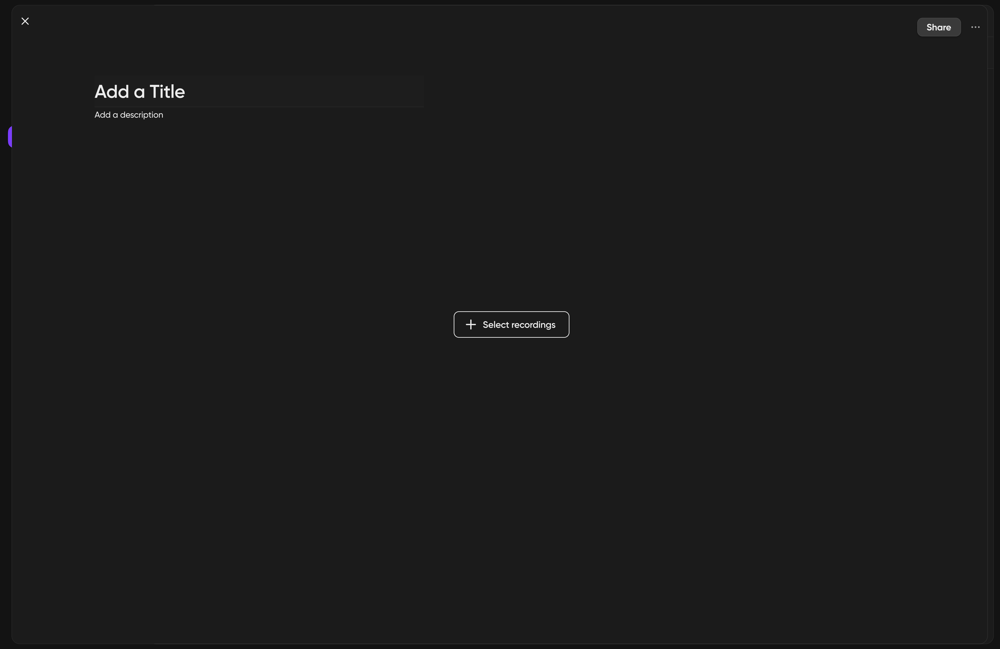
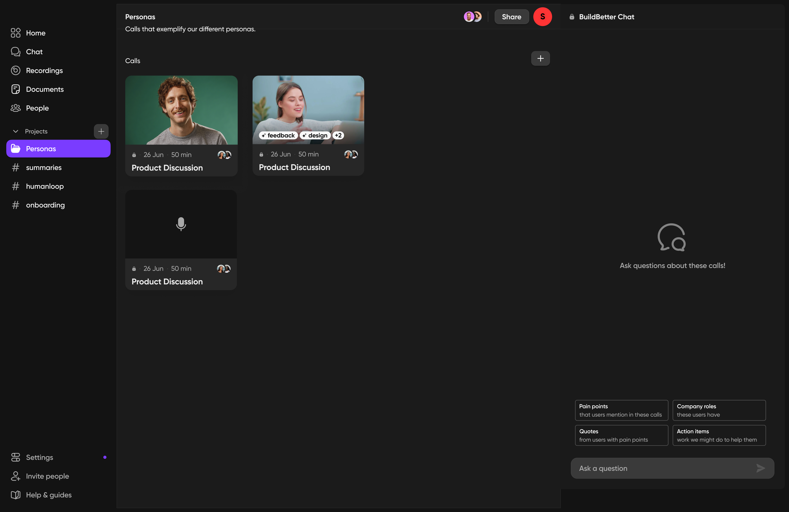

From November 2023 to January 2024, I did contract work for [BuildBetter.ai](https://buildbetter.ai/), an early-stage startup. 

In conversations with coworkers and through doing UX Research, it became clear that BuildBetter's Projects feature needed rethinking. Here's a 1 min. video showing the feature I designed!

<iframe width="560" height="315" src="https://www.youtube.com/embed/5qYsiZrFfbo?si=yA4kO2LJUKNC5VC_" title="YouTube video player" frameborder="0" allow="accelerometer; autoplay; clipboard-write; encrypted-media; gyroscope; picture-in-picture; web-share" referrerpolicy="strict-origin-when-cross-origin" allowfullscreen></iframe>

## Objective

### User Goal
Members of product teams are often overwhelmed with video recordings of user interviews, usability tests, team calls, and collaborative work sessions. Sometimes they rely on what they remember from the calls or from scattered notes rather than rewatching them to extract all valuable information. In the end, they want to organize calls and generate insights based on the real data without needing to rewatch every call or take furious notes during calls.

### Business Goal
Help users get valuable and shareable insights from groups of calls.

## Success Metrics
My contract with BuildBetter ended before they started gathering this data. Here are the success metrics I planned for:
- Number of users who create, visit, and share projects

## Old user flow and JTBD

Here’s how the feature used to work:

JTBD: As a product manager, I want to review project briefs that auto-update based on recordings of my meetings with coworkers so that I can save time from manually updating project briefs.

- user creates a project (essentially a folder)
- user chooses a tag
- the project pulls in every call with that tag and auto-updates any time a call loses or gains that tag
- the project brief regenerates whenever a new call is pulled in or a call is pushed out of the project (e.g. someone removed the tag from the call)

## Pain point 1
Pain points with the old user flow are as follows.

First, using a tag as the organizing principle for a group of calls is too unreliable. Orgs are unlikely to be highly organized with manual tagging and auto-tagging isn’t likely to 100% match a user’s preferences and mental model.

## Pain point 2

The project briefs produced weren't valuable to users. I watched user interviews and chatted with users, and they said call transcripts aren't a solid basis for a project brief. Many calls include idea exploration, killing ideas, going on tangents, and making guesses that then require follow-up work after the call. 

## Hypothesis
Though users want to group calls together, the current requirement to group by a single tag doesn’t pull in the calls users want since it requires manual and automatic tagging to be very organized and error-free (most teams haven’t fleshed out their tagging structure perfectly). In addition, an auto-regenerating project brief doesn't produce high quality document because it doesn't match the true nature of managing a project.

I believed that if we removed the requirement to use a single tag and let users manually select calls, more users would create, visit, and share projects because they have more control over what is inside the project.

## Ideal user flow

## Designs
First, we renamed this feature to Folders, to more accurately setup user's expectations of what the new feature could do. Besides, it matched what most call recording software provides--folders.

I designed the following flow to help users organize calls and generate insights based on the grouped data.

## Homepage sidebar

## Create a new folder

## Add calls to a folder

## Ask BuildBetter to analyze the group of calls

## Future Ideas
If the MVP (v2) of Folders becomes popular, we can add more data types (like chats and documents) to Folders, smart Folders that auto-update according to tags, and eventually add workflows like “create this document with xyz trigger” or “compare customer sentiments about xyz feature over time”.

The ultimate ideal JTBD is as follows:
As a product person, I want to organize data, calls, and chats by project, team, tag, or idea, and then generate insights based on the grouped data.
