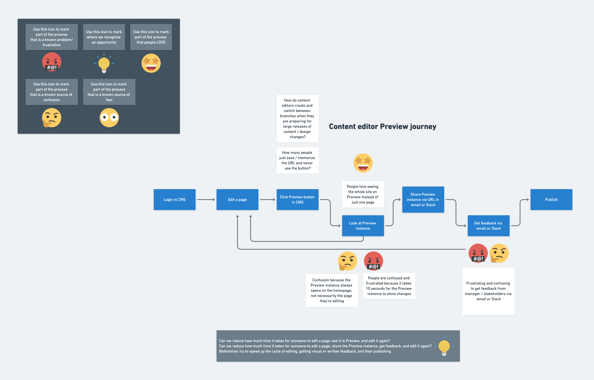

During the end of 2019, I designed a preview experience for content editors using Gatsby Preview.

## The Dilemma

The decoupling of content services and web frameworks means that one single page on a website can display content from multiple data sources. Because of this, content creators and editors can’t easily figure out how to edit the content they see in a Gatsby Preview instance or in their live site.

This is a dilemma, because editing content, seeing it displayed, editing it again, and getting feedback before publishing is a main workflow for content creators.

## My role

I found six content creators to interview and presented actionable results to a team of stakeholders.

## Discovering personas and their jobs to be done

Since Gatsby is a developer tools company, we had some blind spots when it came to designing our product, Gatsby Preview, for non-developers. Non-developers are _crucial_ to shipping a high quality website or app. They create all the products, words, videos, colors, etc. that appear on the web.

Our question: “who is using Gatsby Preview and why are they using it?”

After interviewing six content creators (who did not use Gatsby) and many Gatsby Preview customers, I created a list of personas and their jobs to be done along with an example of what life is like for them.

**Content creators** expect to see content and edit it so they can improve the content’s impact on its audience - increase leads, clickthroughs, etc.

> Jane is a content creator who is helping launch a new version of an Italian restaurant site. She sees a header she wants to edit to make it more SEO-friendly, and has to go hunt around in their headless CMS to answer questions like “Where does this header live? Where can I edit it? Is it even in this CMS?”

**Marketing and content managers** expect to monitor and request changes to the site’s performance and content to make sure the site is reaching marketing goals, like lead generation. Ideally, they’d like to set a performance budget and maintain it.

> Anarik manages a team of marketers and they launched a new women’s shaving products website 6 months ago with excellent lighthouse scores; the website’s performance has been steadily decreasing and he’s not sure how to stop it from happening.

**Stakeholders** expect to assess planned changes to the websites and/or pages they own and give feedback so that the site and/or page reaches business goals

> The PM who manages website that hosts the blog can’t keep track of when the marketing team requests design changes to the blog. Most of the time it’s fine, but every once in a while she really needs to review their proposals before they get implemented.

**Developers** expect to get assignments to improve/fix the Preview instance itself or any part of the website it manages, know what part of the code their assignment relates to, and be able to collaborate/ask questions about their assignments

> Luca gets random Slack messages with requests to update the company’s marketing site all the time, and has to ask people to please put requests in Jira with a screenshot. Sometimes it takes several days for the issue to actually become clear.

## Creating a conceptual design

The purpose of Gatsby Preview is to enable collaboration amongst all people working on a website or app. Through my interviews with users and through evaluating competitors, I described the essential problem in collaboration and identified the heart and soul that would animate a good solution:

## Problem 1 = inefficient feedback cycle

First, website collaboration is often inefficient. Methods like screenshots and/or comments sent via email and Slack are inefficient because the comments are out-of-context, immediately become out-of-date, and are disconnected from tasks/issue workflows.

A solution that **speeds up the feedback cycle** must include:

- **In-context collaboration**. This means showing feedback in the full context/functionality of the live website with precise times and locations for all comments.
- **Up-to-date collaboration**. A way to filter feedback by date or status ensures collaborators focus on relevant, up-to-date feedback. Also, collaborators need notifications when their website or conversation about the website has updates so they can respond appropriately.
- **Collaboration connected to workflows**. When collaborators come up with an actionable idea, their idea should connect to GitHub, JIRA, and Slack so they can track its status.

## Problem 2 = unhelpful feedback

Second, even if the collaboration method is perfect, the content of what people say can still be imperfect. People often give unwise feedback and struggle with making decisions or coming to consensus when designing or revamping a website.

A solution that **helps teams make better website decisions** must include:

- **Freedom of choice** in what feedback to listen to
- **Freedom to seek feedback** from various sources
- **Connection to design workflows**, (especially design systems)
- **SEO and performance measurements** so stakeholders can measure impact of proposed changes

## Documenting the user flow

After interviewing several current customers, I created this user flow to reflect how they actually used Gatsby Preview and what their emotional state was during their flow.

## Presenting results to stakeholders

I presented the above findings to stakeholders and identified

- quick wins to resolve current pain points quickly
- long term ideas to improve strategy to make a product that delights users as it solves their problems and empowers them to make awesome websites
