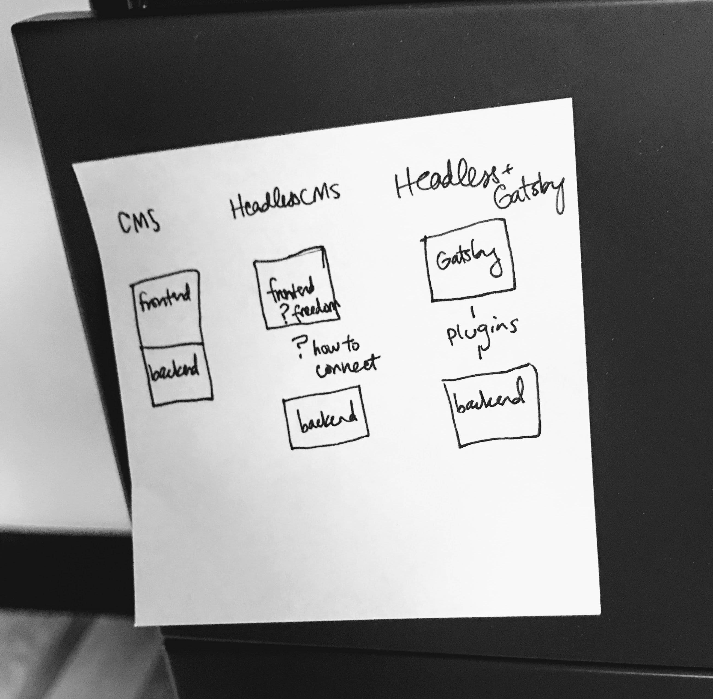
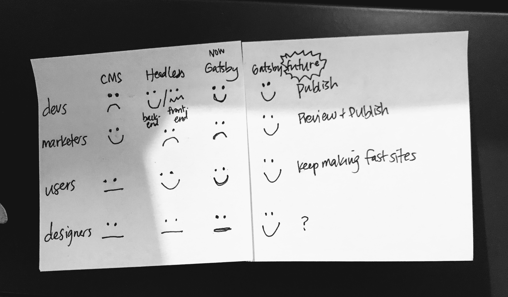
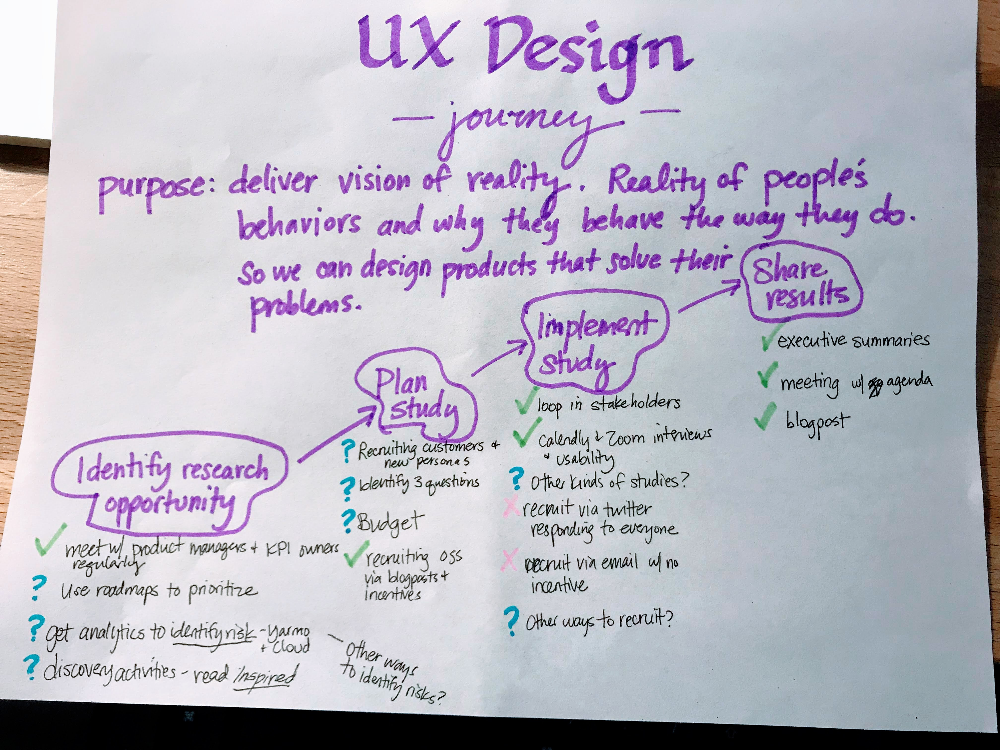
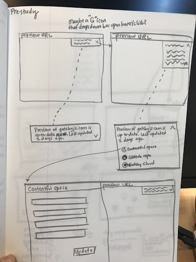
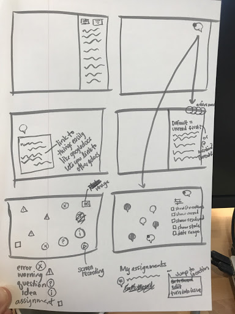
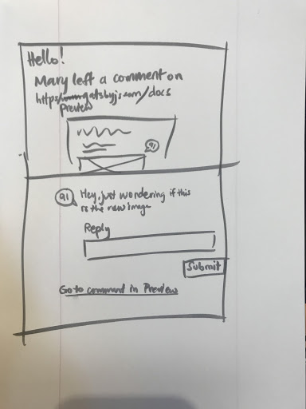
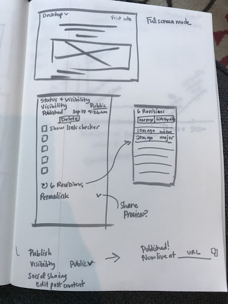

During the end of 2019, I designed a preview experience for content editors working on Gatsby websites.

Gatsby websites pull content from multiple sources, so content creators can’t easily figure out how to edit the content they see on their live site. This means that though developers love building a Gatsby site, content creators don't love working on the site.

Gatsby Preview attempts to make content creators happy. I had these sticky notes by my desk to remind myself of the main goal of Gatsby Preview: make marketers (content creators) happy.

## Documenting the user flow

After interviewing several current customers, I created this user flow to reflect how they actually used our alpha version of Gatsby Preview and what their emotional state was during their flow.

## Quick wins

I proposed the following quick win.

- can we reduce how much time it takes for someone to edit a page, see it in Preview, and edit it again?
- can we reduce how much time it takes for someone to share a Preview instance?

Main goal: speed up the editing and feedback cycle.

## Volunteering to do research

After presenting this user flow to my coworkers, I observed that they didn't know much about content creator's needs.

I created a plan to do more research, got feedback from coworkers, and got approved for the project. Here's my proposed research project, filled out with answers.

[Marketing Workflow Executive Summary](../marketing-executive-summary.pdf)

## Scrappy recruiting

After contacting developer customers and asking for intros to their content creator coworkers without much success, I felt blocked in the project. It occurred to me I could draw out my own user flow for the steps to a successful research project and identify my own pain points.

After identifying that that recruiting customers via Twitter and email wasn't working for content creators as well as did for developer customers, I realized I didn't have to rely on customers. I personally know many marketers and writers, so I reached out on Facebook and Twitter and quickly filled up my calendar with meetings.

Another idea to make recruiting easier was to incentivize developers to give me referrals by placing them on a list of people who get to test alpha and beta features. I did this for later projects.

## Discovering user flows

To make sure I didn't ask leading questions, I planned broad, open-ended questions and tested them with a couple content creator coworkers.

1. Where are you located?
2. What is the name of your company?
3. What is the name of your role?
4. How long have you been in that role?
5. How and when did you start doing what you’re doing?
6. What are some of the most recent projects you’ve worked on?
7. What are your main activities?
8. Do you work at all on your company’s websites? If so, what do you do? How often?
9. What is the process to get an update onto the website? Who are the people you have to work with to get the update on the website?
10. How long does it take to get an update on the website?
11. How do you measure whether you’re successful at working on the company website(s)?
12. What is hard about measuring success?
13. What is currently the biggest blocker to success with the company’s website(s)?
14. What are the other hardest parts of your job?

_If needed, ask more specifically what pain points they experience when trying to be successful at their job and the measures of success they mentioned in answer to question 9._

## Discovering personas and their jobs to be done

After interviewing 8 content creators (who did not use Gatsby) and many Gatsby Preview customers, I created a list of personas and their jobs to be done along with an example of what life is like for them.

**Content creators** expect to see content and edit it so they can improve the content’s impact on its audience - increase leads, clickthroughs, etc.

> Jane is a content creator who is helping launch a new version of an women's shaving supplies site. She sees a sub-header she wants to edit to make it more SEO-friendly, and has to go hunt around in their headless CMS to answer questions like “Where does this header live? Where can I edit it? Is it even in this CMS?”

This is a tour through Jane's eyes.

**Step 1:** Content creator sees a problem on the website.

**Step 2:** Content creator searches for the text in the CMS and gets no search results

**Step 3:** Content creator goes to Slack to ask their developer coworkers for help editing the copy.

**Step 4:** It turns out the copy is hard-coded, and the developers have to edit it.

## Secondary personas

**Marketing and content managers** expect to monitor and request changes to the site’s performance and content to make sure the site is reaching marketing goals, like lead generation. Ideally, they’d like to set a performance budget and maintain it.

> Anarik manages a team of marketers and they launched a new women’s shaving products website 6 months ago with excellent lighthouse scores; the website’s performance has been steadily decreasing and he’s not sure how to stop it from happening.

**Stakeholders** expect to assess planned changes to the websites and/or pages they own and give feedback so that the site and/or page reaches business goals

> The PM who manages website that hosts the blog can’t keep track of when the marketing team requests design changes to the blog. Most of the time it’s fine, but every once in a while she really needs to review their proposals before they get implemented.

**Developers** expect to get assignments to improve/fix the Preview instance itself or any part of the website it manages, know what part of the code their assignment relates to, and be able to collaborate/ask questions about their assignments

> Luca gets random Slack messages with requests to update the company’s marketing site all the time, and has to ask people to please put requests in Jira with a screenshot. Sometimes it takes several days for the issue to actually become clear.

## Creating a conceptual design

To avoid becoming blind to opportunities outside our product's current scope, I interviewed people who didn't use Gatsby so I could see the root problems of website creation, regardless of whether a content creator uses Gatsby.

## Problem 1 = inefficient feedback cycle

First, website creation is often inefficient. Methods like screenshots and/or comments sent via email and Slack are inefficient because the comments are out-of-context, immediately become out-of-date, and are disconnected from tasks/issue workflows.

A solution that **speeds up the feedback cycle** must include:

- **In-context collaboration**. This means showing feedback in the full context/functionality of the live website with precise times and locations for all comments.
- **Up-to-date collaboration**. A way to filter feedback by date or status ensures collaborators focus on relevant, up-to-date feedback. Also, collaborators need notifications when their website or conversation about the website has updates so they can respond appropriately.
- **Collaboration connected to workflows**. When collaborators come up with an actionable idea, their idea should connect to GitHub, JIRA, and Slack so they can track its status.

## Problem 2 = unhelpful feedback

Second, even if the website creation method is perfect, the content of what people say can still be imperfect. People often give unwise feedback and struggle with making decisions or coming to consensus when designing or revamping a website.

A solution that **helps teams make better website decisions** must include:

- **Freedom of choice** in what feedback to listen to
- **Freedom to seek feedback** from various sources
- **Connection to design workflows**, (especially design systems)
- **SEO and performance measurements** so stakeholders can measure impact of proposed changes

## Long term ideas

I looked through many competitor's products and started sketching some ideas. My favorite inspirations are Figma's commenting system (which isn't perfect) and WordPress's Gutenberg editor (which also has its flaws).

## User can see where each part of page comes from

## User can sort and filter comments by type

## User gets notified of new comments via email

## User can track versions of site

## MVP

I proposed the following MVP for a next iteration.

- To enable up-to-date feedback between internal stakeholders, user can leave comments and read comments on the site preview. The comment must be anchored in place and time.
- To get notified about important comments and changes, user can be notified via email and Slack when someone @mentions them in a comment on the site preview.

This was a really light-weight MVP proposal. See this design document for my ideas for phase 2 and phase 3 of the product.

[Gatsby Preview Design Document](../preview-design-document.pdf)
