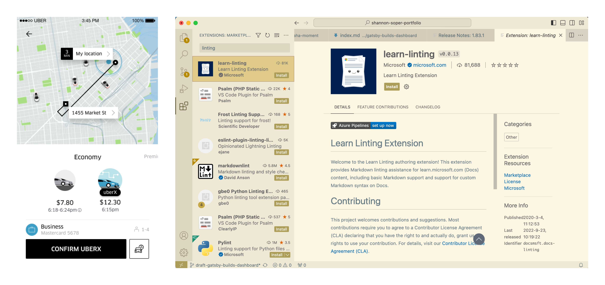

## What’s unique about developer tools design? How is it different from other consumer-facing products?

Popular answer to this question: developer tool design is entirely different from consumer product design. My answer: they actually share the same fundamental design principles, and yet the way a designer executes on those principles in the UI often looks very different.

I’ll give an example of one fundamental design principle and how the same principle can lead to wildly different user experiences. 

## Present the data necessary to answer user’s questions

Bret Victor, a designer, writes that one way to decide what makes a “good” design is to ask yourself “does this design present all the data necessary to answer a user’s questions?”

Let’s compare a user’s questions when ordering an Uber vs. creating a website from scratch. 

If I’m ordering an Uber, I ask things like “which ride is the best deal? Which car is big enough for my child’s stroller? Will it arrive fast enough?” I am satisfied when the app answers those questions for me.

If I’m creating a website from scratch and using VS code, I might want to compare plugins or extensions and have questions like: “does this plugin meet my needs? Is it reliable? How easy is it to get started?” The way the UI helps me answer these questions looks a lot more dense than Uber’s app does because it presents me with 50x more data. 

## Information density

The density of data in dev tool design is often necessary because users have open-ended questions like “is there a faster way to create routes for my website’s pages?”. A good designer friend of mine, Anton, says that a “hyper-saturated interface” is common in creative tools, as opposed to interfaces that users only use for consumption of data.

Developers are professionals who are getting paid to make creative choices that require a lot of human work. In other words, the tool can’t do all their work for them. Uber does almost all the work for the user. VS code doesn’t get the user nearly as close to completing their task, and that’s because that task requires way more expertise.

## “Too cluttered” or cluttered enough? 

Here’s a personal story about how I made a design decision when working at Gatsby.

When I posted my first sketches for Gatsby’s plugin library in a general design slack community feedback channel (not focused on dev tools), people said it was too cluttered and that there was not enough white space. 

In contrast to this negative feedback, the Gatsby open source community loved the design. I considered both types of feedback and then made a judgment call based on fundamental design principles.

I stuck with the “cluttered” design because it did a good job of answering the user’s main questions. 

## Infinite hidden interactions

Even with the densest possible interface, there’s not enough room for all the interactions a developer needs. For example, In a Javascript file in VS code, the system will suggest things to me, but only after I start typing. I have to have something in mind before I start typing something. That’s because the UI simply doesn’t have room for everything that a person can fit in their head. No-code tools try to change that but it’s really hard to replace the human brain :). 

## What difference can design principles make in developer tools?

Developer tools have a lot of room to improve how much work they do to simplify the lives of developers who use the tool.

The biggest difference a designer can make in a dev tool is to play with the timing and placement of data. 
- When does the user need this data? 
- What data is most important and how can I draw attention to it? 

Uber’s designers ask the same questions but they hide a lot more data because users don’t need it. E.g. they probably could present each vehicle’s tire brand, but who wants that?

## Summary

In practice, developer tools show more data so users can make an endless number of creative decisions, whereas consumer-facing products surface only the data required to make one or two choices, and the choices are the same across thousands of people (e.g. will I buy this or not? Will I post this or not?).
