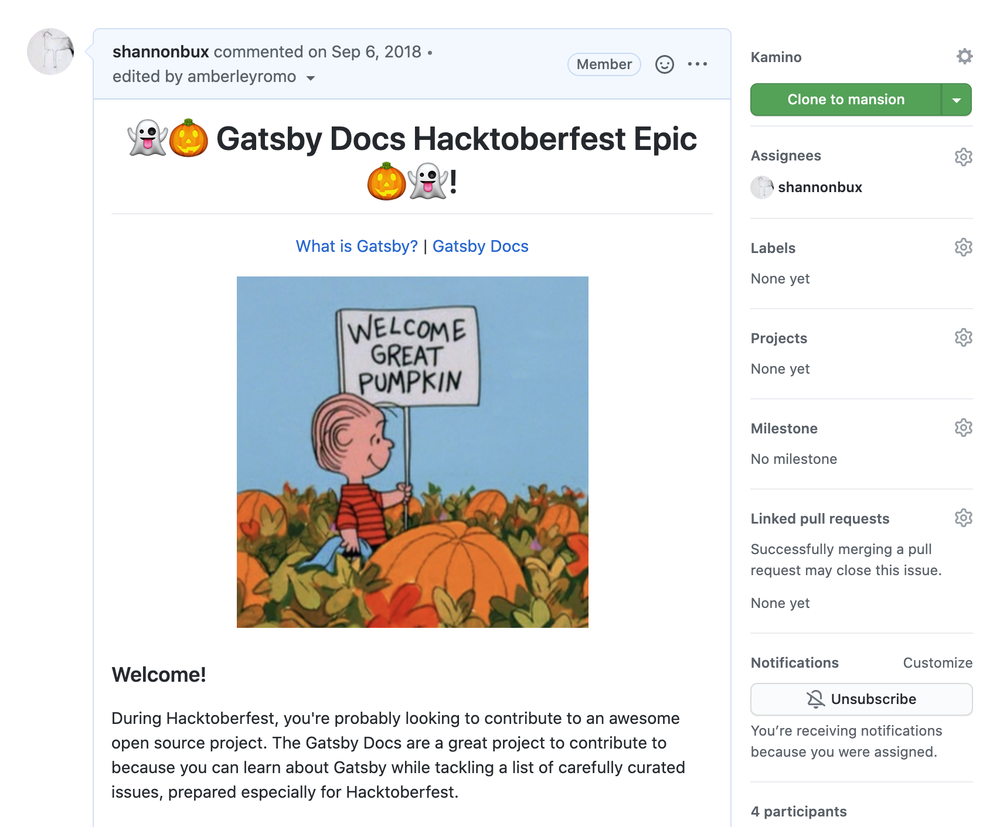
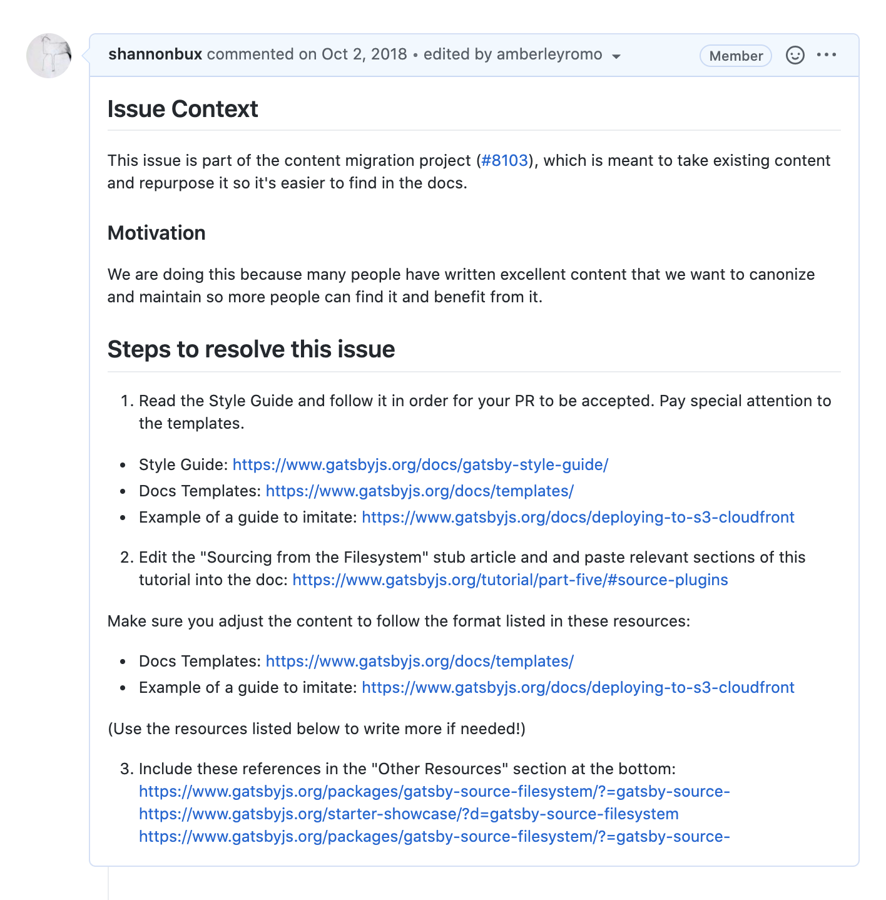
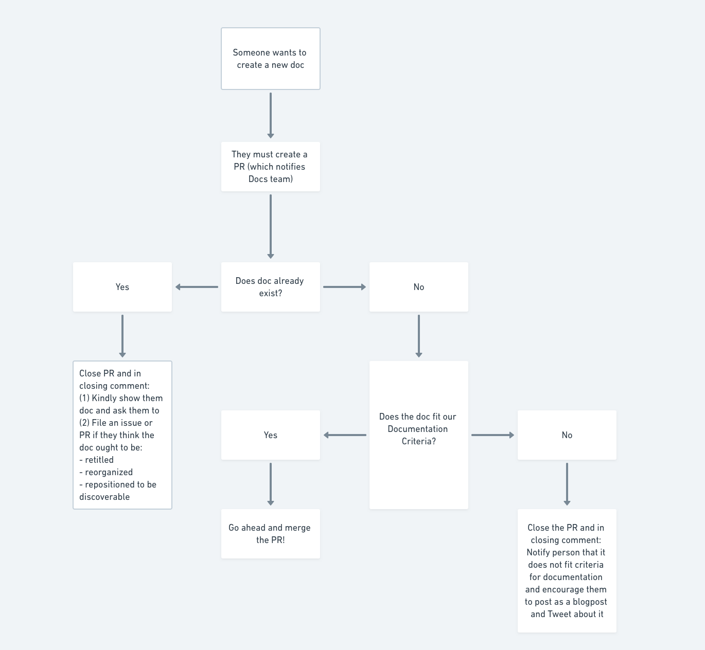
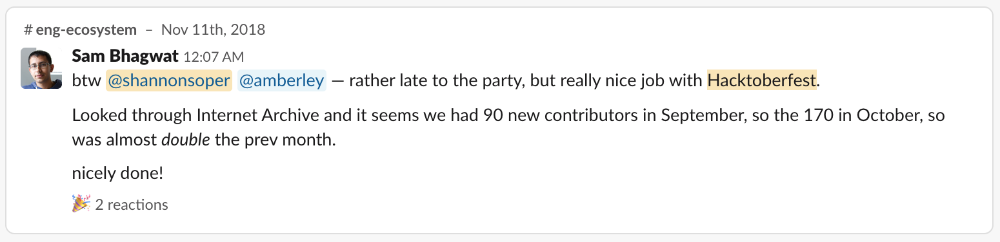
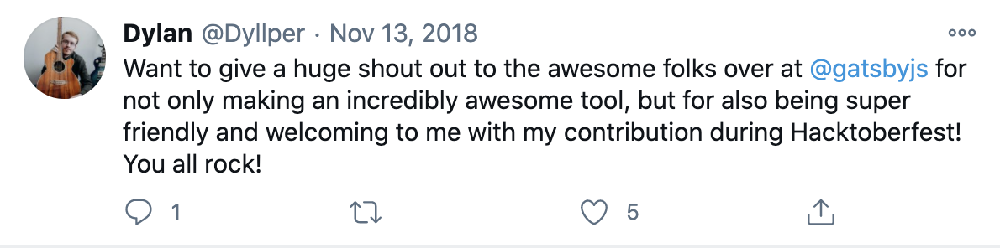

Many React developers (or those interested in learning React) test out Gatsby by building portfolios, blogs, marketing sites, and e-commerce sites. Through dozens of interviews, I discovered that this persona struggled to find the right documentation for common tasks, like adding a manifest file. There were many reasons for this:

- menu items had inconsistent naming conventions, so users didn't know what to search for with ctrl+f
- menu was long enough to extend below the fold, so some items weren't visible
- there was no site search
- some common tasks were missing from the docs and only existed in the tutorial or plugin READMEs

<small>Here's a screenshot of what the sidebar looked like in late 2017</small>

## Design solutions

First, I setup card sorting and usability tests to learn what categories and naming schemes would match the user's language. I decided to use nouns for categories and -ing verbs for docs since most tasks are action-oriented (e.g. adding links) and wrote [the Gatsby Style Guide](https://www.gatsbyjs.com/contributing/gatsby-style-guide/).

  

## Running Hacktoberfest

Second, I ran [a Hacktoberfest docs contribution project](https://www.gatsbyjs.com/blog/2018-10-12-uptick-docs-contributions-hacktoberfest) to merge over 30 docs contributions. To help the contributions get merged smoothly, I created a “Hacktoberfest” welcome issue, created an issue label, labelled dozens of carefully crafted issues, created stub articles, and used the Gatsby Style Guide to teach contributors. Myself and many maintainers **merged over 30 significant (not just typo fixes) docs contributions**.

<small>This landing page welcomed folks to our Hacktoberfest project.</small>

<small>[This issue](https://github.com/gatsbyjs/gatsby/issues/8730) has enough instructions to ensure speedy merging of PRs and closing of issues.</small>

Because the influx of contributions took so much time to review, I also created a decision tree so myself and other maintainers could decide whether to merge a doc contribution or not.

<small>Here's one branch of the decision tree.</small>

Gatsby appeared in **Hacktoberfest's top projects** to contribute to in 2018. My contribution was a significant part of our success. Please see [a summary of all the success we experienced](https://www.gatsbyjs.com/blog/2018-11-01-hacktoberfest-wrapup/), which included code contributions.

## Accordion vs. flat menu?

Here's a quick dive into a perplexing part of this project. We wanted a design that was:

- visually pleasing
- searchable

Yet it seemed hard to accomplish both at the same time, because accordion menus make design visually pleasing, yet flat menus make items searchable by keyboard navigation (ctrl+f).

I decided to compromise with the following plan:

- default to a collapsed accordion
- include an expand all button
- save the state of the accordion menu for returning visitors

  

This isn't a perfect design. In usability testing, I noticed that some people missed the "expand all" button so we tweaked the design until it was easier to see. Also, saving the state of the menu for each user is in the backlog.

_Original post at [the Gatsby Blog](https://www.gatsbyjs.com/blog/2018-07-31-docs-redesign)_
