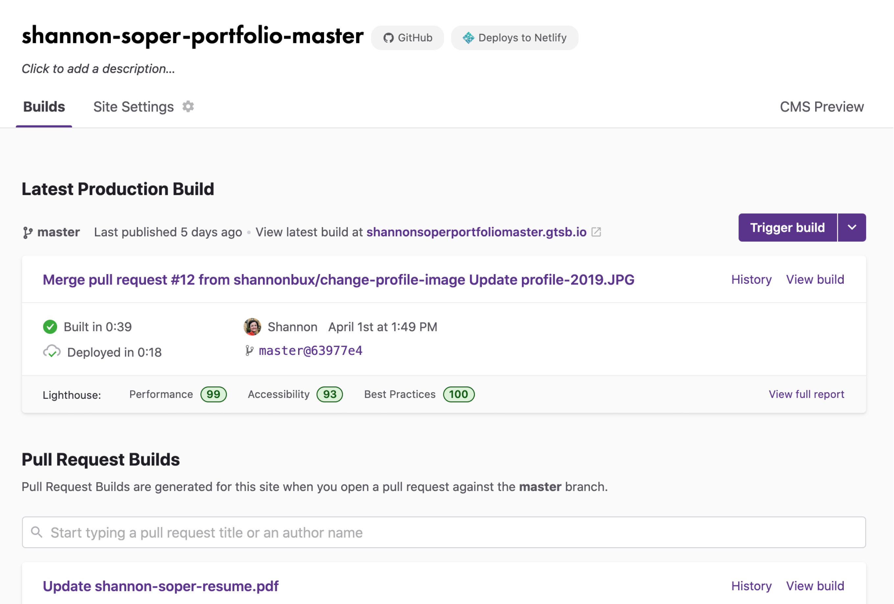
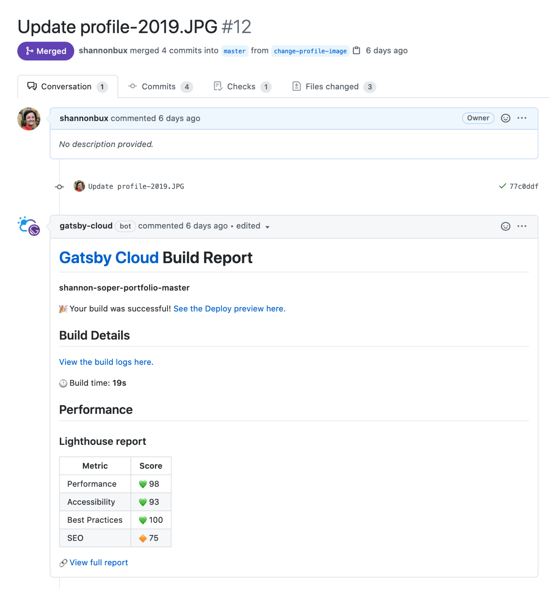
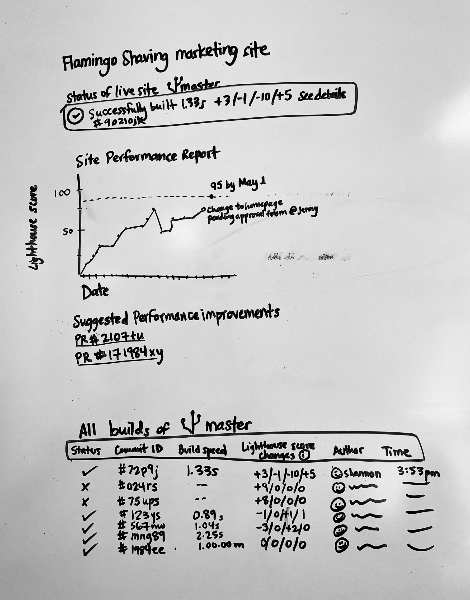

## What is Gatsby?
Gatsby is a free and open source framework based on React that helps developers build blazing fast websites and apps. Litte Caesar's launched their Gatsby website during the Superbowl; it loaded fast for every user and never went down, despite the huge influx of traffic. Fun! 

## What I did
I redesigned and shipped a new version of Gatsby Cloud's Builds dashboard, which enabled it to come out of beta and launch its commercial offering. 

This dashboard helps users browse the status of all proposed changes to their website so they can catch and fix any errors. The dashboard presents these error summaries in a more easily readable format than the CLI or GitHub. And, since we could analyze their website in nuanced ways by knowing so much about how Gatsby websites are ideally built, we hypothesized that we could also offer specific suggestions to improve their website's performance. 

As part of the design process, I did the following:
- Ran UX Research process
- Ran team sketching sessions
- Ran prototype testing and validation

## Previous design & jobs to be done
Through setting up interviews with users and inviting coworkers, I identified two main jobs to be done:
1. As a developer, I want to see the impact of potential site changes on site performance so I can determine whether to adopt the change
2. As a developer, I want to see errors and warnings in potential site changes so I can resolve them to make the site function properly

The previous design left users with open questions, like "ok, I see there was an error, but which PR introduced that error? And how can I see how merging this PR might impact my site's performance?"

So, the previous design fell short of helping the user with their 2 main jobs to be done.

## Mapping user questions to available data
I used the following quote to guide my design decisions during this project.

> “Edward Tufte’s first rule of statistical graphic design is, “Show the data.” All information graphics...must present the viewer with enough information to answer her questions.”

<small>—Brett Victor, “Magic Ink”</small>

With this quote in mind, I made a list of user questions and mapped what data would answer their questions. I've highlighted one of those pairs below, to show a good example.

## Sketching exercises
After identifying jobs to be done, I ran internal team sketching sessions. We asked ourselves how we might help users accomplish their jobs to be done.

Here's a collection of sketches by myself and other team members, showing how our ideas converged and diverged. It was awesome to get great ideas from coworkers; they all were skilled developers and had personal familiarity with the painpoints of our previous design and ideas on how to solve those pain points.

## Meeting users where they are
Interestingly, the earliest moment Gatsby Cloud could help users was in GitHub, where users briefly check for errors before merging a PR. We created a GitHub bot that gave users an overview right in their PR comments. The bot gave them this information:
- the impact of potential site changes on site performance
- errors and warnings in potential site changes
- link to more details in Gatsby Cloud

This bot fit into the existing workflow of our users and was quick to scan.

GitHub doesn't have a ton of room for designing custom things, so I designed the information hierarchy and icons:

<!--## Users can dive into details when they want
Before we designed the UI here, users scanned raw logs to identify errors and calculate the time of each step in the process. These summaries saved them time.

[Image coming soon]
 

## Advanced usage
The design still provided raw logs so we could see what additional data processes users performed to identify which common patterns we could adopt into the UI.

[Image coming soon]
 -->

## How we evaluated results
- FullStory clips
- 5 usability tests

The dashboard enabled Gatsby to come out of beta and launch its commercial offering.

## Why did the solution work?
We presented the user with prioritized data which allowed them to focus on their website’s biggest problems and/or biggest opportunities.

## Future idea
One feature we didn't ship yet was showing site performance changes over time. We wanted users to be able to do these things:
- set performance goals
- track their progress towards those goals
- identify not just their site's performance scores, but also the trends; e.g. is performance better after the most recent PR merged or worse?

The design we shipped gave a static snapshot of performance measurements, and users needed to track trends and compare past and future in order to trouble-shoot their website's performance and evolve the website over time.
