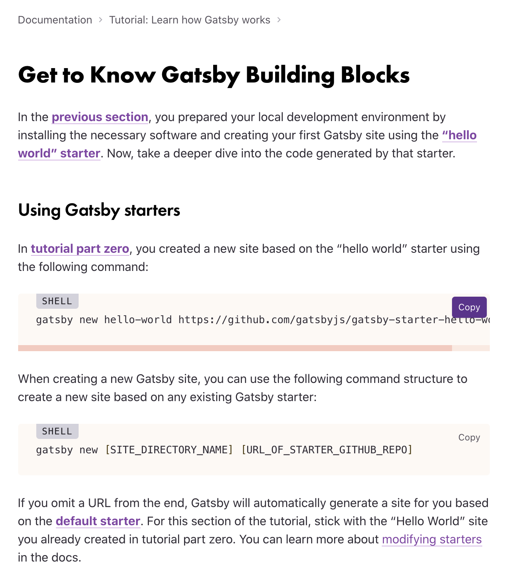
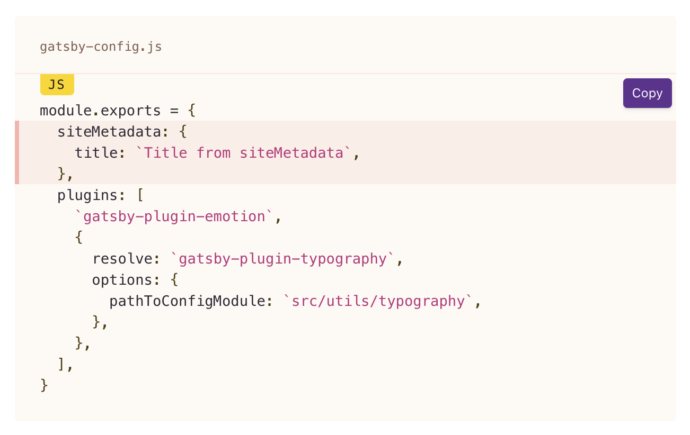
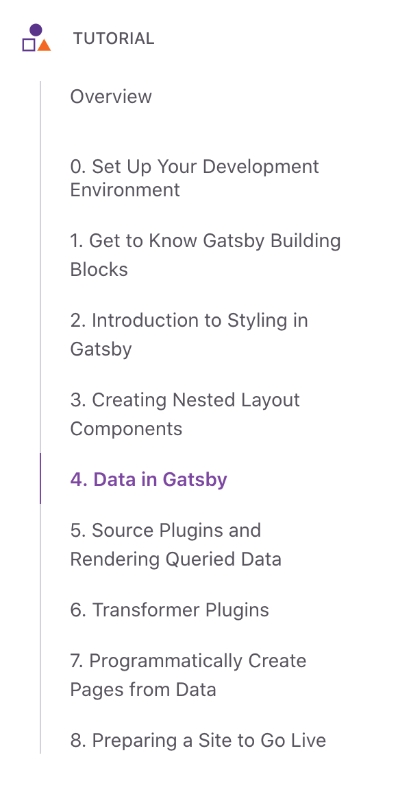
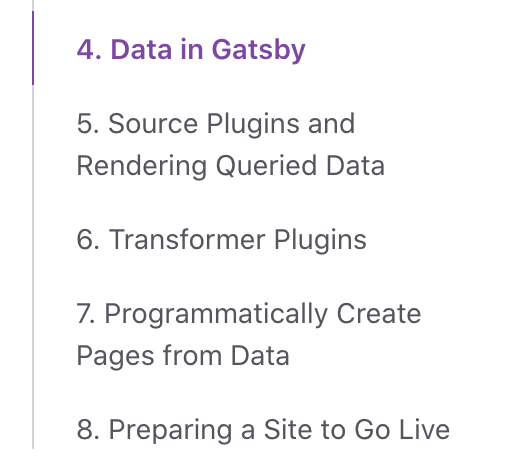

(_article under construction_)

I rewrote the main Gatsby tutorial. Before my revision, it was already super high-quality. The founder wrote it and edited it constantly based on feedback, and developers _loved_ it, often citing it as the main way they learned React.

## Why fix what isn't broken?

It wasn't super broken! There also were clear opportunities to guarantee more people finished it.

## Missing the last backtick

### Before

People often missed the last backtick in graphql code snippets if their screen resolution didn’t make the ticks very visible. Also, sometimes the code snippet was too long to be visible in the window. Then, when they pasted the incomplete code snippet into their code and saved it, they got an error.

### After

I designed a copy button which has reduced the number of errors people run into. Future improvements could be designs that show backticks clearly even on varying screen resolutions, and clearer error messages.

## Pasting the code snippet in the wrong file

### Before

Because the tutorial indicated which file you should be editing within the paragraph preceding the code snippet, people often missed the file name and pasted code snippets into the wrong file, which produced an error.

### After

I increased the information hierarchy of the file name and brought it closer in proximity to the copy button, so people now see the file name right next to the copy button. This change reduced the # of errors people run into.

## Giving up on the tutorial

### Before

Some beginners didn't proceed past part 1 of the tutorial, which assumed they already had a development environment setup.

### After

I created a part 0 of the tutorial for people who need to install VS Code and Prettier.

## Drinking too much coffee

### Before

In addition, many people dropped out of the tutorial when they arrived at part 4, for two reasons. Most people were new to the topic, GraphQL, and the super long page intimidated them.

> “Parts 1 through 3 of the tutorial were like "one coffee cup" modules. It took me many cups of coffee to make it through part 4.” —a very funny person

### After

I broke part 4 into smaller pieces (parts 4-8), which increased the percentage of people who finished the tutorial.

## Hooray! Open sourcing tutorial workshops

Most of these ideas came from running face-to-face workshops and watching people go through the tutorial.

I [shared the workshop materials so anyone could run their own workshop](https://www.gatsbyjs.com/blog/2018-05-31-open-sourcing-gatsby-workshops). Tons of people wanted and want to learn React, so we sponsored folks with a food stipend if they ran a meetup about Gatsby, including if they ran this workshop.
