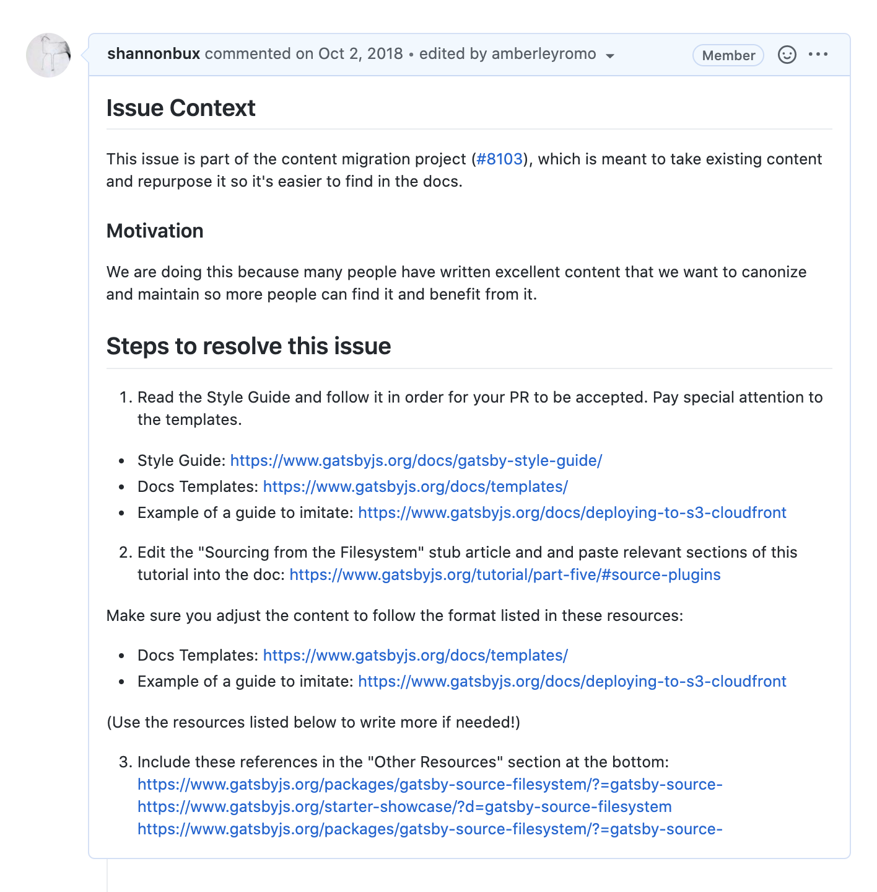
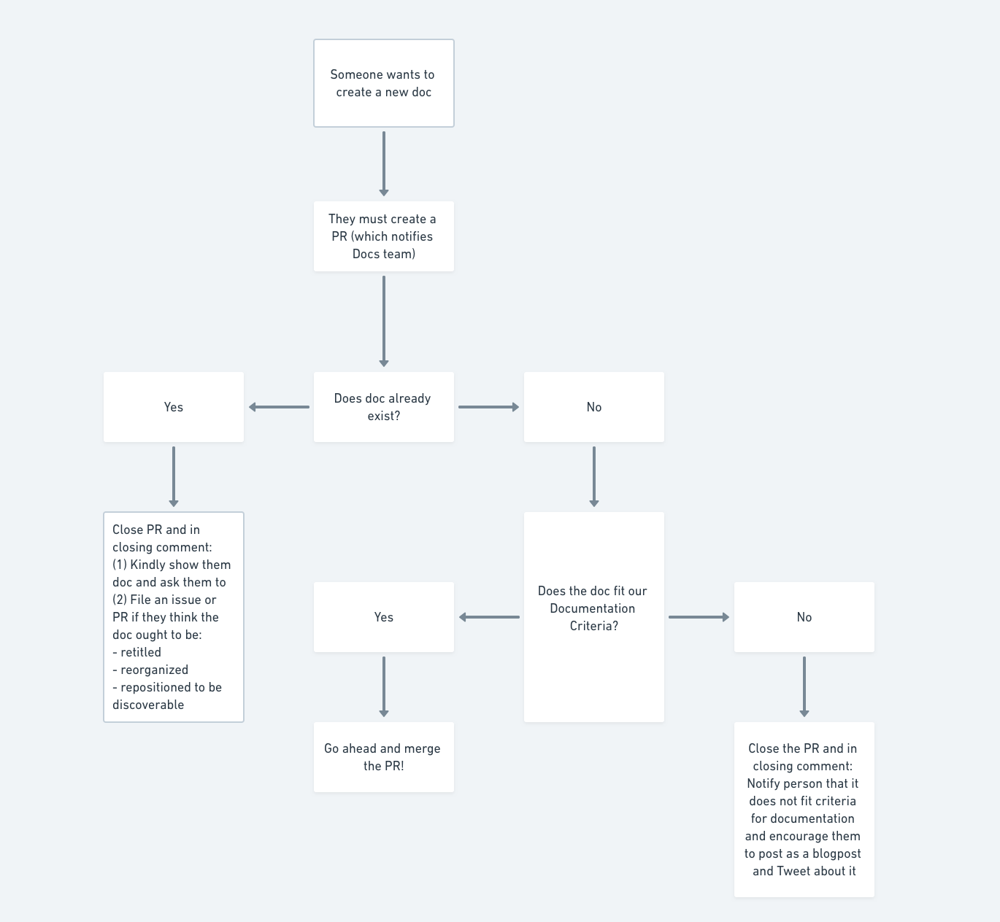
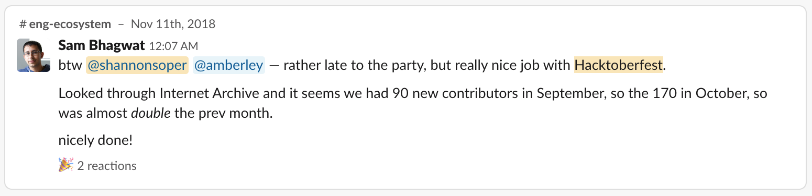
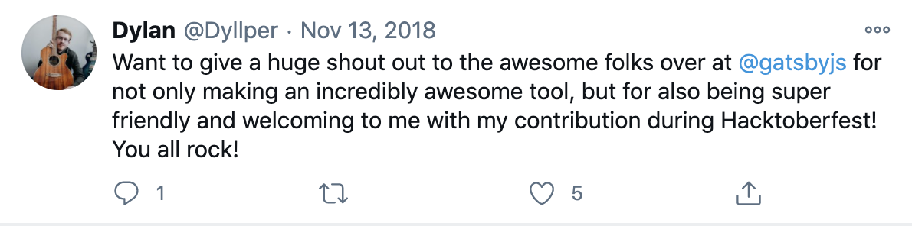

[Hacktoberfest](https://hacktoberfest.digitalocean.com/) is a celebration of open source projects every October. To participate, you sign up at [this website](https://hacktoberfest.digitalocean.com/), get a number of PR’s merged to a participating open source project, and get a t-shirt.

Gatsby was a participating open source project for Hacktoberfest in 2018, and I helped **double our number of new contributors that month.**

## The challenge

To understand the user flow for a Hacktoberfest contributor, I looked at Hacktoberfest’s list of projects to contribute to. It took three hours to find a project that had a beginner-friendly issue that I could resolve (side note: I did find one and got a t-shirt!).

My conclusion was that we could **differentiate ourselves** with our Hacktoberfest onboarding. If newcomers could spend less than 3 hours finding a Gatsby issue to resolve, we’d have a leg up.

## Giving a welcoming first impression

First, I created a clear, welcoming first impression. This “Hacktoberfest” welcome issue is the first thing any new contributors saw.

## The opportunity

Initially, Hacktoberfest wasn’t on my radar. However, after interviewing Gatsby users and creating a long list of TODO’s to improve the docs, I hypothesized that some of the TODO’s could be accomplished by newcomers during Hacktoberfest.

From a year of trying other methods to increase docs contribution, I guessed that Hacktoberfest wouldn’t be a silver bullet. It already wasn’t easy to attract new contributors and help them successfully contribute to Gatsby; why would Hacktoberfest change those facts?

## Creating a pit of success

To make sure folks continued to have a good experience beyond their first impression, we designed [issues that set contributors up for success](https://github.com/gatsbyjs/gatsby/issues/8730).

To increase the chance that any given PR would be merged, myself and a developer, Amberley Romo, created a template for docs issues to make them nearly fool proof. The issues included excruciatingly specific instructions to nearly guarantee that PR submissions would meet our expectations. This meant the PR’s could be speedily merged.

## Helping my coworkers succeeed

After submitting a PR for review, another pain point for contributors is getting the PR actually merged. Sometimes the open source maintainers don’t respond for weeks or leave cryptic responses.

Through chatting with my coworkers, I learned what **friction they experienced in merging PR’s**. They had good intentions and yet they often didn’t know what to say and/or didn’t have the time to help a newcomer clean up their PR.

I tackled this problem by **planning for edge cases that could slow down our response time**. For PR’s and issues that didn’t meet the project’s needs, I **created a decision tree**. This helped myself and other maintainers respond appropriately and consistently to each contributor.

## Systematizing our responses

Pointing people to the Gatsby Style Guide (which I wrote) saved us from crafting the same responses over and over again.

## Doubling new contributors

Gatsby appeared in **Hacktoberfest’s top projects** to contribute to in 2018. My contribution was a significant part of our success. Please see [a summary of all the success we experienced](https://www.gatsbyjs.com/blog/2018-11-01-hacktoberfest-wrapup/). We also merged **over 30 docs contributions** in the course of a month.

## Supporting contributors

The team of Gatsby maintainers gave new contributors a great experience. It was fun to be part of this project and see that it made a difference for folks new to open source projects!

It’s also nice to have a break. I’m glad its Hackt_over_fest.

