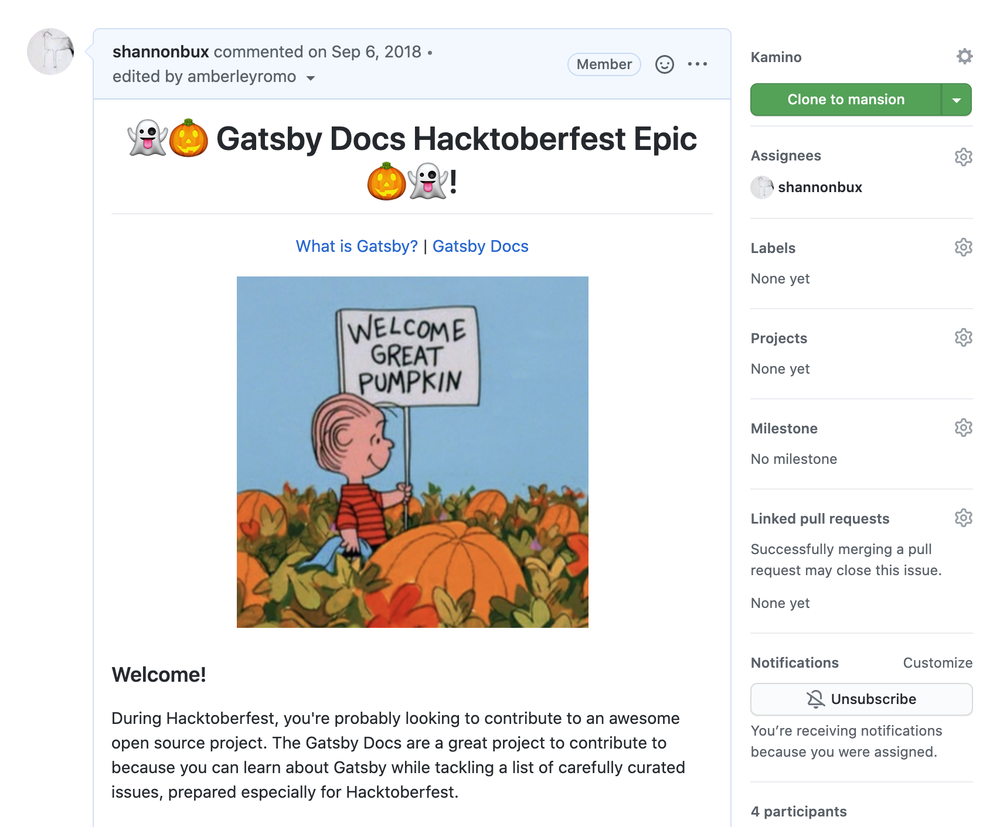

I ran a [Hacktoberfest docs contribution project](https://www.gatsbyjs.com/blog/2018-10-12-uptick-docs-contributions-hacktoberfest) to merge over 30 docs contributions to the Gatsby open source project.

## The challenge

I'd heard of Hacktoberfest before and had this idea. There was a long list of TODO's to improve the docs and some of them could be accomplished by newcomers, I thought.

To scope out the competition and empathize, I looked at Hacktoberfest's list of projects to contribute to. It took three hours to find a project that had a beginner-friendly issue that I could resolve (side note: I did find one and got a t-shirt!).

Conclusion: it was very difficult to find issues that didn't require deep expertise in the project.

## The opportunity

It seemed we had a low risk, high impact opportunity to help newcomers have a good experience getting a contribution merged. Also, we had issues that really needed to get done, so it was a win-win situation.

This “Hacktoberfest” welcome issue is the first thing they saw.

<small>This landing page welcomed folks to our Hacktoberfest project.</small>

## Creating a pit of success

One of the challenges of open source work is responding to contributions that need a lot of reworking before they can be merged. To learn what **friction my coworkers experienced in merging PR's**, I asked them questions. I knew they had good intentions, and yet they often didn't know what to say and/or didn't have the time to help a newcomer clean up their PR.

I tackled this problem in two ways.

First, I set out to **create a pit of success**. Myself and a developer, Amberley Romo, created a template for docs issues to make them nearly fool proof. The issues included excruciatingly specific instructions to nearly guarantee that PR submissions would meet our expectations. This meant the PR's could be speedily merged.

<small>[This issue](https://github.com/gatsbyjs/gatsby/issues/8730) has enough instructions to ensure speedy merging of PRs and closing of issues.</small>

## Helping my coworkers succeeed

Second, we **planned for edge cases that could slow down our response time**. For PR's and issues that didn't meet the project's needs. I **created a decision tree**. This helped myself and other maintainers respond appropriately and consistently to each contributor.

<small>Here's one branch of the decision tree.</small>

## Systematizing our responses

Pointing people to the Gatsby Style Guide (which I wrote) saved us from crafting the same responses over and over again.

## Doubling new contributors

Gatsby appeared in **Hacktoberfest's top projects** to contribute to in 2018. My contribution was a significant part of our success. Please see [a summary of all the success we experienced](https://www.gatsbyjs.com/blog/2018-11-01-hacktoberfest-wrapup/). We also merged **over 30 docs contributions** in the course of a month.

## Supporting contributors

The team of Gatsby maintainers gave new contributors a great experience. It was fun to be part of this project and see that it made a difference for folks new to open source projects!

