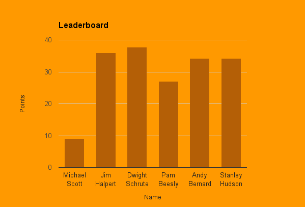
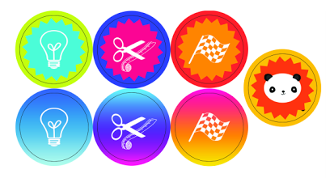

Back in 2015, the VP of Sales at Instructure told me that the 250+ sales people in his organization were not using a [_The Challenger Sale_](https://www.challengerinc.com/) methodology he wanted them to use. **He asked me to help them adopt the new methodology**. As the company's sole instructional designer, I got to work creating a series of learning experiences with effective incentives.

## Asking for clarification

I was fresh out of college and after I sat down to work, I freaked myself out by imagining the VP of Sales had some ideal project in mind and just wasn't giving me the details. After worrying for a day or two, I **asked my manager for more details** about the project. She and I set up a meeting with the VP of Sales. He clarified that he didn't care how I reached the goal, as long as I reached it.

## Not reinventing the wheel

I felt **excited to be entrusted with freedom to lead the project** and dove in with quick wins that built on each other.

I pored over materials from _The Challenger Sale_ organization and found an idea from another company that we could copy: a pilot program where a small group has to read _The Challenger Sale_ and present what they learned to the whole sales organization with some prizes involved.

## Building up user motivation

I liked the idea and **modified the pilot program with my knowledge of educational and motivational psychology**.

What I decided is that on at least a weekly basis, the learning experience should:

- emphasize intrinsic motivation (seeing yourself progress and master a skill)
- provide recognition / competition from peers and superiors
- promise cash rewards (or other valuable items)
- utilize peer pressure

## Breaking up content into bite-sized pieces

The book was long and our sales reps were busy (and many were not inclined to read as a hobby), so I decided to **break up the principles of the book into short courses** that could be completed in an hour or less per week.

## Making people feel special

Then, I asked sales managers to nominate people for this pilot learning program.

## Creating thunder

I arranged some brainstorming time with a superb advertiser at the company. After our conversation, I made a [commercial advertising the project](https://www.youtube.com/watch?v=5C8fr5QjoXc) a la [Sarah McLachlin's SPCA commercial](https://www.youtube.com/watch?v=IO9d2PpP7tQ) and emailed it to the nominees to let them know they'd been chosen for this experience and could opt in if they were interested in the potential cash rewards and awards ceremony.

Everyone opted in!

## Iterating quickly

In order to move quickly, I didn't wait to finish the project before releasing it.

Every Friday afternoon, I released a new course with individual challenges and team challenges.

## Applying what they learned

Each course focused on a chapter or part of a chapter from _The Challenger Sale_ book and included three optional activities that were worth points and incentivized users to **apply what they learned** to their real jobs, which is what makes new information stick.

- 1 point activities: take a quiz on what you learned
- 2 point activities: write about what you learned
- 5 point activities: use what you learned in a current sales opportunity and report your experience to coworkers and me

Along with each course, I **emailed an updated screenshot of a leaderboard to the pilot teams and their managers**. At first I was nervous that it was too scrappy to make a “dumb google spreadsheet” to track and communicate results, but it turned out that it was a cheap and effective way to get the job done. Here's an example screenshot with fictional names. I regret the too-subtle color contrast.

## It started working...

On Friday afternoons, I started **overhearing a few sales people cajoling each other "c'mon man, you gotta finish the course so we can win!"**, so my plan seemed to be working :)

## Providing recognition and rewards

The winning team and winning individual had to (got to :) present what they learned to the whole sales organization at the culmination of the competition. They also received gift certificates.

## Providing intrinsic motivation

_Anyone_ who finished _any_ course also got magnets that I designed to signify which skill they learned from their course, because I wanted folks to recognize their own progress and mastery of new skills even if they didn't win.

The top row borrows colors from Canvas for our Canvas Sales Reps and the bottom row borrowed colors from the Bridge product, for Bridge Sales Reps. The panda was Instructure's mascot.

The colors appear garish on the web because they were designed for printed magnets.

The icons were free online (at this point I hadn't developed any pixel art skills) and **represented the three Challenger sales skills** a sales rep ought to master:

1. Teaching for Differentiation (the lightbulb icon)
2. Tailoring for Resonance (the scissor + measuring tape icon)
3. Taking Control of the Sale (the flag icon)

The panda magnet was awarded when a person completed all courses and assignments and meant they were Challenger "certified".

## Hosting the summit

This pilot program went swimmingly and ended in a fun culminating party where the winning teams and individuals received awards, everyone who completed courses got magnets to show what they completed, and they could keep working beyond the deadline to get any magnets they didn't have yet.
