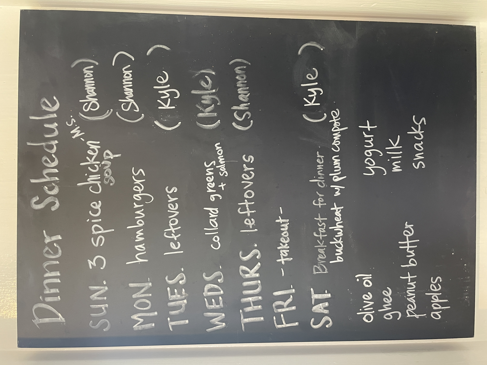
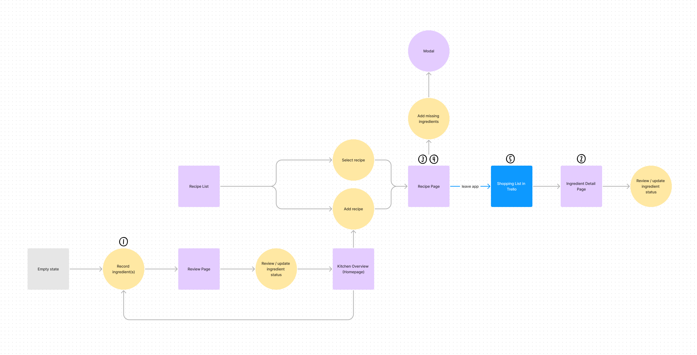
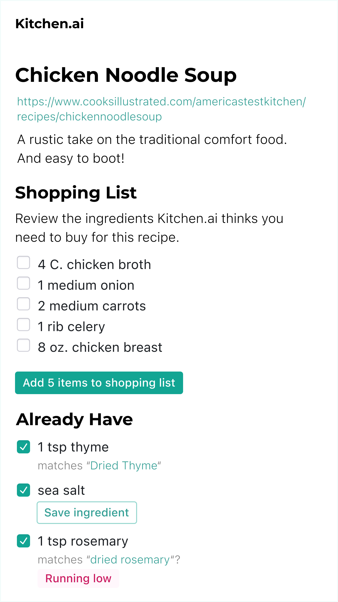
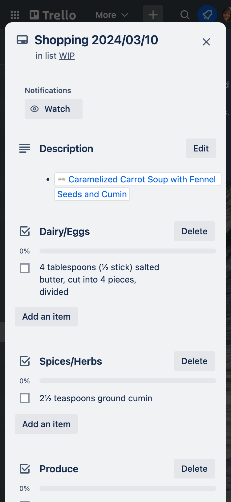

I’ve been working on a side project called Kitchen.ai. It’s an app that uses AI to make smart grocery shopping lists, organized by store sections and updated according to your kitchen’s contents.

## Demo
Here’s a video of me doing the following with Kitchen.ai v0.1:
- adding ingredients from a photo
- reviewing a recipe
- creating a shopping list

## How did I design this? Short version
I designed Kitchen.ai, starting with UX Research and ending with high fidelity wireframes & live UI reviews with Kyle Mathews (who engineered and collaborated!). 

I created a design system, building off WorkOS’ fabulous open source project [Radix UI](https://www.radix-ui.com/) and Victor Allegret's community [Figma file](https://www.figma.com/community/file/1280428825266545105) based on Radix UI. 

Using the community file as a starting point, I created components, a theme, and font ramps. I'm planning a followup post that's a deep dive into my experience using Radix UI!

## Why design Kitchen.ai?
So why design Kitchen.ai in the first place? Here are common pain points people face when shopping for groceries:

## Jobs to be done

As home cooks, we want to:

- Make food with fresh ingredients so it is healthy and delicious
- Make it easy to prepare for shopping trips, so we are more likely to plan healthy, delicious meals
- Minimize amount of time searching for ingredients in grocery store, so we enjoy our trips
- Reduce chance of return trips to get forgotten ingredients

For an interface to help us do those jobs, it needs to answer two questions:
1. What ingredients do I need to buy to make this recipe?
2. Where are the ingredients in the store?

## What we tried and why it didn’t work
What we tried for a while was writing a list of recipes on a chalkboard, then adding the necessary ingredients to a Trello card. On that card, we’d mark off what we already had and drag the ingredients into an order that matches the store layout.

## Pain points—shopping with half a brain

Here’s a story about the pain points in our old workflow. 

I’m wandering around the grocery store, browsing a shopping list on my phone for pumpkin bread and chicken noodle soup. The list: 
- 2 tsp Cinnamon
- ½ tsp Nutmeg
- Milk
- Celery
- Chicken breasts (1 lb)
- Thyme
- Carrots
- Chicken broth

I go to the spices and herbs aisle first. I forgot to check how much cinnamon we have at home. I call my husband to see if he’s home. He’s not. Does he remember how much cinnamon we have? No.

I put a jar of cinnamon in my cart.

I walk over to produce to get celery and carrots, then realize I forgot to get dried thyme in the herb aisle, since it wasn’t grouped with cinnamon and nutmeg on the list. I have to walk back.
 
At home, I see we have enough cinnamon already! I stash the newly purchased, surplus cinnamon on a top shelf and hope I remember it when we run out of the current jar.

## New user flow, using AI
These frustrating pain points can be solved with artificial intelligence (AI :)! Photo processing and AI have become good enough to meet our needs and answer our questions better and faster. 

Kitchen.ai uses AI to resolve pain points in 5 ways (see corresponding numbers in the image below):
1. identifies multiple ingredients in one photo
2. generates ingredient descriptions
3. takes pasted recipe text and generate a list of ingredients
4. matches ingredients in the recipe to ingredients you already have, even when the names aren’t an exact match (e.g. olive oil and extra-virgin olive oil)
5. organizes shopping lists by grocery store section

## Recipe page
Each recipe you add to Kitchen.ai has a list of ingredients to review. It places ingredients you have in the “Already Have” section of the page. You can adjust the list as needed. For example, Here I’m planning to uncheck cumin since even though I have it, it’s running low so I’d like to buy more.

## End result: Trello card shopping list
Here’s a trello card generated by Kitchen.ai. Look at how nicely Kitchen.ai grouped ingredients by store section!.

## Which AI-powered products are models for Kitchen.ai?
Did you know these common apps use AI (often without advertising it!) to identify and categorize things? These apps are part of what sparked the idea for Kitchen.ai.
- [Merlin Sound ID](https://support.ebird.org/en/support/solutions/articles/48001185783-sound-id): This app uses machine learning to identify bird songs from audio recordings.
- [PictureThis](https://www.picturethisai.com/identify): This app calls itself “AI-powered plant identifier in your pocket”. When you take photos of plants in this app, it identifies the plant and gives you its name, health status and recommendations for care & watering. It even tells you fun facts about the plant’s history, including poems or literature that refer to it!
- [Google Photos](https://www.androidauthority.com/google-photos-facial-recognition-back-3333108/): This app identifies people (even from behind!) in photos, using machine learning. This makes it easier to search for photos of specific people.

## Kitchen.ai v0.2 and beyond
I had so much fun with this project and learned a lot about what AI is good at and what it’s not, and how it can enhance our quality of life through things like making grocery shopping easier!

Future use cases for Kitchen.ai (what it could be, given more time and resources):
- Reduce waste by *generating novel recipes* that use what you *already have* in your kitchen
- Create a shopping cart full of ingredients for you to approve before it makes an online purchase