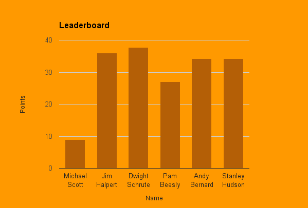
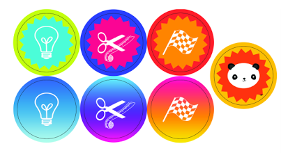

The VP of Sales told me that the 250+ sales people in his organization were not using a new sales methodology he wanted them to use, and he asked me to solve that problem. As the company's sole instructional designer, I got to work.

## Feeling scared

I was fresh out of college and at first, I imagined the VP of Sales had some ideal project in mind and just wasn't giving me the details. After worrying for a day or two, I asked my manager for more details about the project and she and I set up a meeting with the VP of Sales. He emphasized that he didn't care how I reached the goal, as long as I reached it.

## Unfiltering my creativity

I felt so excited to be entrusted with such an enormous project and dove in with quick wins that built on each other.

I pored through materials from _The Challenger Sale_ organization and found an idea that could harness our sales team's competitive style: a pilot program where a small group has to read _The Challenger Sale_ and present what they learned to the whole sales organization with some prizes involved.

## Building up user motivation

I liked this idea and decided to improve it with my knowledge of educational and motivational psychology.

I ensured that each phase of the competition included a variety of incentives:

- emphasizing intrinsic motivation (seeing yourself progress and master a skill)
- providing recognition / competition from peers and superiors
- promising cash rewards (or other valuable items)
- utilizing peer pressure

## Making people feel special

First off, I asked sales managers to nominate people for this pilot learning program. Then I scored some brainstorming time with a superb advertiser at the company. He sparked some ideas, and I made a ["commercial" advertising the project](https://www.youtube.com/watch?v=5C8fr5QjoXc) a la [Sarah McLachlin's SPCA commercial](https://www.youtube.com/watch?v=IO9d2PpP7tQ) and emailed it to the nominees and let them know they'd been chosen for this experience and could opt in if they were interested in the potential cash rewards and awards ceremony.

## Iterating quickly

In order to move quickly, I didn't wait to finish the project before releasing it.

Every Friday afternoon, I released a new course with individual challenges and team challenges.

Each course focused on a chapter or part of a chapter from _The Challenger Sale_ book and included three optional activities that were worth points.

1 point activities asked users to take a quiz on what they learned
2 point activities asked users to write about what they learned
5 point activities asked users to use what they learned in a current sales opportunity and report their experience to coworkers and report back to me

Along with each course, I released an updated screenshot of a leaderboard to the pilot team and their managers.

## It's working...

I overheard a few sales people cajoling each other "c'mon man, you gotta finish the course so we can win!" every Friday afternoon, so my plan seemed to be working :)

## Providing recognition and rewards

The winning team and winning individual had to (got to :) present what they learned to the whole sales organization at the culmination of the competition. They also received gift certificates.

## Providing intrinsic motivation

_Anyone_ who finished _any_ course also got magnets that I designed to signify which skill they learned from their course, because I wanted folks to recognize their own progress and mastery of new skills even if they didn't win.

