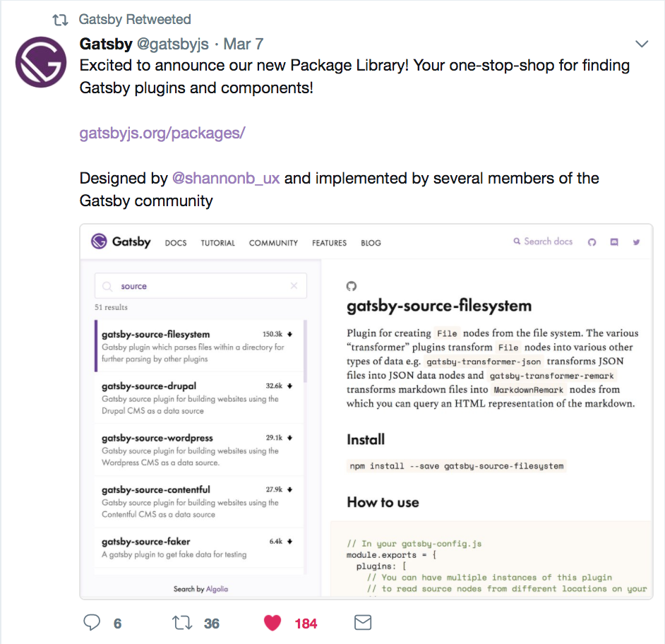

Many of Gatsby’s powerful capabilities come from its plugin system and wide array of community contributed plugins. But finding and creating plugins hasn’t always been easy. After hearing these common complaints while interviewing Gatsby users a few years ago, I drew an “empathy map” to put myself in their shoes.

## Presenting this empathy map

I shared this research with Gatsby’s co-founders and the community and saw [enthusiasm for the idea of making a plugin library](https://github.com/gatsbyjs/gatsby/issues/3003).

## Learning from other plugin libraries

Instead of reinventing the wheel, I analyzed over 10 admirable and/or popular plugin libraries to draw from their strengths and learn from their weaknesses. Examples include:

- [JS.coach](https://js.coach/)
- [VIM Awesome](https://vimawesome.com/)
- [Best of JS](https://bestof.js.org/)
- [Sketch extension library](https://sketchapp.com/extensions/)
- [Chrome plugin library](https://chrome.google.com/webstore/detail/plugins/mmcblfncjaclajmegihojiekebofjcen?hl=en)
- [Microsoft Visual Studio Code Extensions](https://marketplace.visualstudio.com/VSCode)
- [Wordpress Plugins](https://wordpress.org/plugins/)
- [Npms.io](https://npms.io/)
- [Yarnpkg.com](https://yarnpkg.com/en/packages)
- [Apple App store](https://www.apple.com/ios/app-store/)
- [Google Play store](https://play.google.com/store/apps/top)

## Increasing information density

Through showing my prototypes to designer friends vs developers, I learned that developers preferred a more information dense view while designers preferred a cleaner view. Since this library is for developers, information density offers advantages to that persona, so I chose information density over simplicity.

## Prototypes and their evolutions

Here’s a GIF depicting prototypes I designed. I sought feedback from many community members and incorporated their feedback.

<video controls="controls" autoplay="true" loop="true">
  <source type="video/mp4" src="/gatsby-plugin-library-compressed.mp4"></source>
  
Your browser does not support the video element.

</video>

## End result

Since the launch of [the Plugin Library](https://www.gatsbyjs.com/plugins) and plugin authoring docs in March 2018, the library has grown from 51 plugins to 3,000 plugins. The most used plugin is downloaded 1.7 million times per month. There are about 60k unique visitors per month as of December 2020.

_[See original post on the Gatsby Blog](https://www.gatsbyjs.com/blog/2018-03-07-why-we-created-the-plugin-library)._
