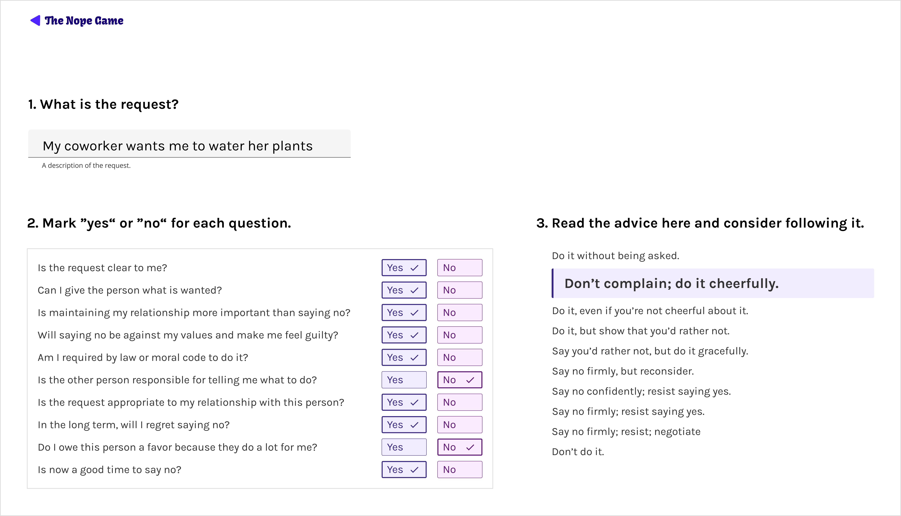
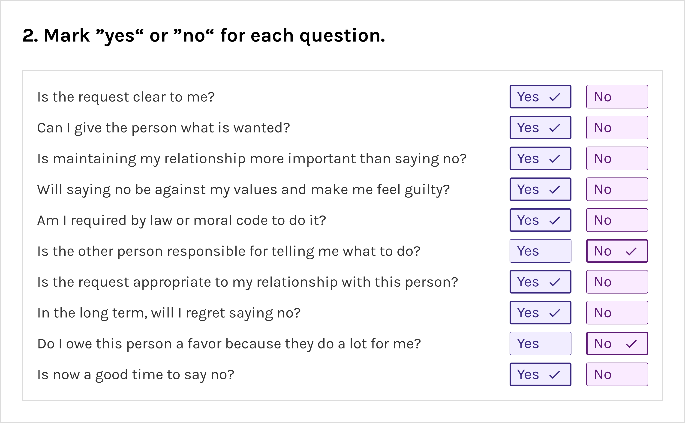
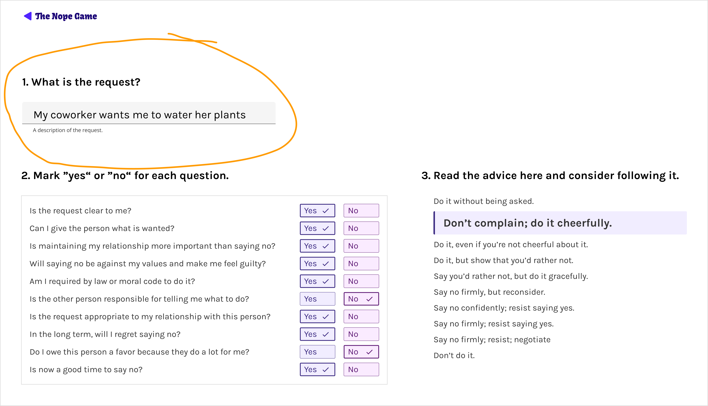

## Your dog wants to go on a walk at midnight
Let’s say your dog wants you to take it on a walk at midnight. If you're not sure whether you want to say yes or no, you could use this game I designed, The Nope Game, to decide on your response.

[Play v0.1 of the Nope Game here!](https://thenopegame.gtsb.io/). 

This game, a passion project of mine, acts like a friend who helps you not only decide _whether_ to say yes or no to a particular request, but also _why_ your response makes sense. It can imbue you with confidence when you respond to your dog, because you can justify why you said yes or no.

## The Dilemma

It’s hard for many people to evaluate the impact of people’s requests on their time. If you say yes now, will you regret it later? If you say no, will you lose your resolve if the other person pushes back?

I personally decided to train my ability to say no (or yes) with confidence using something called The Dime Game (the inspiration for my app, The Nope Game). It leads the user through a series of questions and, based on the answers to those questions, calculates a recommendation. 

<small>The worksheet for the original Dime Game</small>

<!-- replace these images with crisp pdf images -->

## Gaining empathy

Through **using this game 100+ times and recommending it to dozens of people,** I gathered the insights necessary to create an empathy map.

## Lowering the barrier to entry

I often avoided using the worksheet because I didn’t want to print a new one every time I needed to use it. Printing it was a minor tedium that created enough friction to justify avoiding the task.

I’d even look at the worksheet and, without writing on it, try to memorize my answers. Just to avoid reprinting it.

So, for a while I’d print stacks of worksheets to delay time between printing jobs. Finally, I **lowered the barrier to entry by making the worksheet reusable**. I laminated it and used erasable markers on the laminated version.

## Separating user flows

The left and right side of the worksheet look almost identical, which made users assume they needed to fill out both the left and right columns. However, most people just need to use either the left or the right, because the columns correlate with 2 different scenarios:
- the left side of the worksheet is helps you decide how strongly to _ask_ for something
- the right side of the worksheet helps you decide how strongly to say _no_ to a request

To avoid this confusion, my design sends users down a path that's custom-fit to their scenario.

The first path I focused on is _decide how strongly to say no_ to a request.

## Branding the app

The name “The Dime Game” doesn’t offer clarity about what users can expect from the game. After some brainstorming, I renamed it “The Nope Game.”

Even though it’s possible to say yes to a request, I wanted a memorable name. Another option was “The Hell No Game”, but the icon and URL didn’t look compact or easy to read. “Nope” is a single word that succinctly communicates the heart of the game.

In my brainstorm, saying yes, no, and maybe conjured memories of Magic 8 Balls and watching the triangle floating to the top with the answer appearing as white text with blue liquid around it.

**Abstracting the Magic 8 Ball image** led me to a rounded equilateral triangle shape, the purplish blue color, a font that recalls 80’s game shows. Here’s a first draft of the **abstract combination logo**.

## Reducing cognitive load

### Doing math for the user

At the heart of The Nope Game are a series of yes or no questions. If you look at an example of the worksheet after someone has used it, they scribble “yes” or “no” or checks and x’s in the margin because the worksheet doesn’t have an official place to write answers.

In addition, there’s some tricky math involved in adding up the responses. To save the user from doing the math, and **to reduce the amount of work it takes for them to track their answers** to each question, I put the game into a survey format on the app.

### Creating a visual reminder

One of the last questions on the worksheet is a sticking point for many people and blocks them from finishing the game. “Do I know what I am saying no to? (Is the other person clear about what is being asked for?)”. A text input box had advantages over a yes or no survey question.

If the user is able to write down the other person’s request in the text input box, the request must be clear enough. **Writing your answer and seeing it offers powerful validation** that yes, you _do_ know what you’re saying no to and the text **sticks to the top of the screen so you can refer back to it at any point**.

<!-- Only add this section back in once I get the new image from the game, showing the suggestion not to continue the game

## Preventing unecessary user interaction

One survey question is a deal breaker. If you answer “no” to “Can I give this person what is wanted?”, there is no need to take the rest of the survey because, without further effort, you tell the person “no, I can’t do that.” The survey needed to prioritize this question so users could skip the rest of the survey if they answer no.

 -->

## Evolving the game

The project now exists on the web in early form! [Play v0.1 of the game here](https://thenopegame.gtsb.io/). I’m currently testing it with users before investing in the visual design.

- users can save notes under each survey question so they can remember their reasoning, and to make the details viewable and editable at a later time if they want to revisit the decision
- users can share the results of their game with others to get their friends to weigh in on their decision. It’s helpful to get alternate perspectives to see if they validate or differ from yours

## A special thanks

I’d like to thank Marsha M. Linehan, the author of the worksheet, and Doug Benson, the person who introduced me to it.

> “People have not caused all their own problems; They have to solve them anyway.”

<small>—Marsha M. Linehan, author of _DBT Skills Training_, includes the Dime Game worksheet</small>
