For 6 months, I was the Product Designer for this solo project called [the Nope Game v0.1](https://thenopegame.gtsb.io/). This project has been enormously fulfilling because it connects to my passion for clear communication.

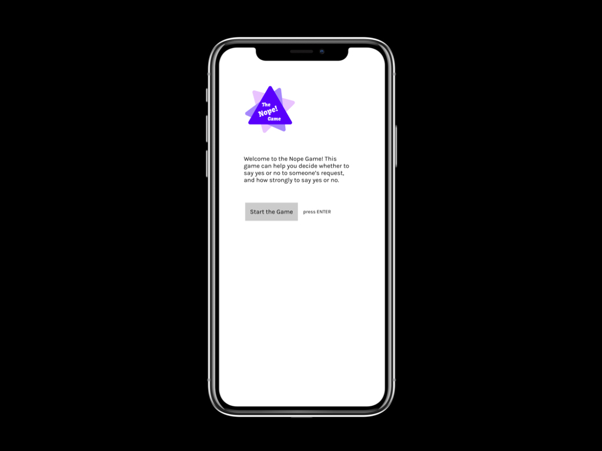

## The Dilemma

It's hard for many people, including me, to evaluate people's requests on my time and abilities. If say yes now, will I regret it later?

To train my ability to say no (or yes) with confidence, I use something called The Dime Game (the basis for The Nope Game). It leads the user through a series of questions and, based on the answers to those questions, calculates a recommendation. Let's say your dog wants you to take it on a walk at midnight. You could use the game to evaluate whether to say yes or no to your dog's request and how strongly to say yes or no.

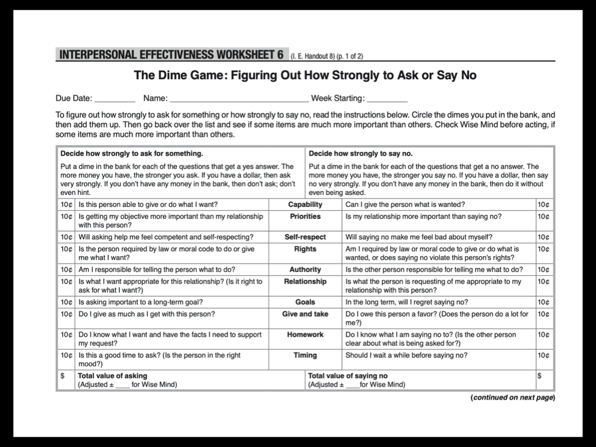

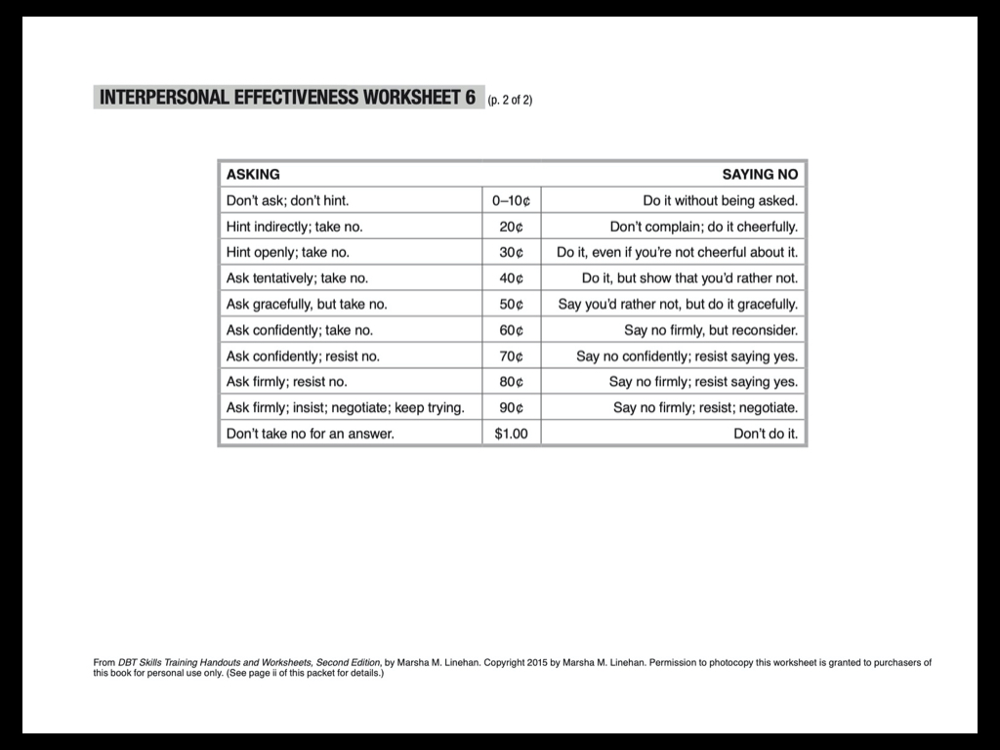

## Why I care

This game acts like a friend who helps you not only decide _whether_ to say yes or no to a particular request, but also _why_ you answered the way you did. It imbues people with confidence when they're prepared to justify why they're saying yes or no.

## Gaining empathy

Through **using this game over 100 times and recommending it to friends, family, and coworkers, I gathered the insights necessary** to create an empathy map.

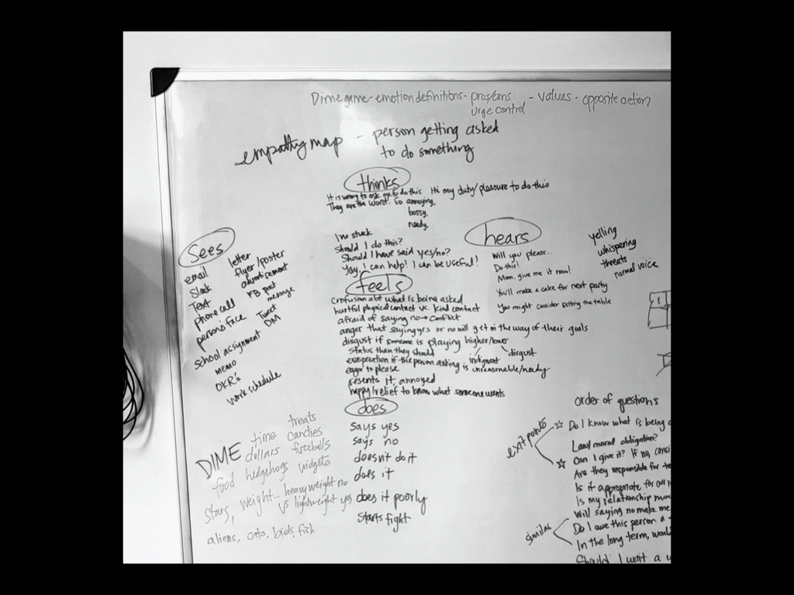

## Lowering the barrier to entry

I often avoided using the worksheet because I didn't want to print a new one every time I needed to use it. Printing it was a minor tedium that created enough difficulty to justify avoiding the task.

I'd even look at the worksheet and, without writing on it, try to memorize my answers. Just to avoid reprinting it.

So, for a while I'd print stacks of worksheets to delay time between printing jobs. Finally, I **lowered the barrier to entry by making the worksheet reusable**. I laminated it and used erasable markers on the laminated version.

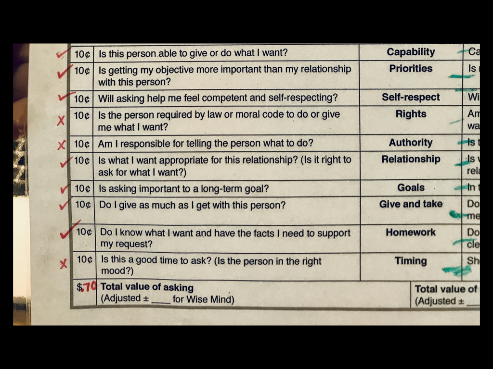

## Signifying the fork in the road

The left and right side of the worksheet, though they don't look like it, present a fork in the road of decision making. The left side of the worksheet is useful if you want to decide how strongly to _ask_ for something. The right side of the worksheet is useful when you need to decide how strongly to say _no_ to a request.

Even though most folks just want to use one side of the worksheet, it looks like you're supposed to fill out both sides. The confusion arises because **both sides of the worksheet have the same level of hierarchy**.

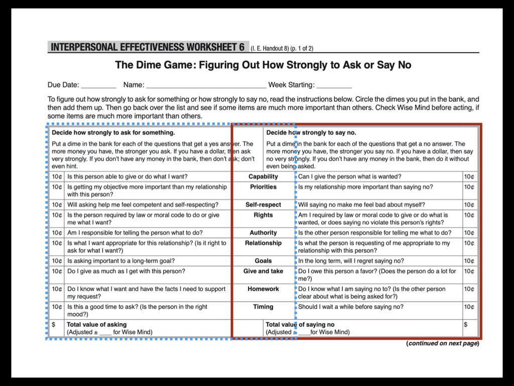

The question that actually deserves the highest level of visual priority is “are you asking for something or responding to a request?”

I decided to **create experiences custom-fit to each path** in the fork.

## Paving the path

The first path I focused on is _decide how strongly to say no_ to a request. The name "The Dime Game" doesn't offer clarity about what users can expect from the game. After some brainstorming, I renamed it "The Nope Game."

Even though it's possible to say yes to a request, I wanted a memorable name. Another option was "The Hell No Game", but the icon and URL didn't look compact or easy to read. "Nope" is a single word that succinctly communicates the heart of the game.

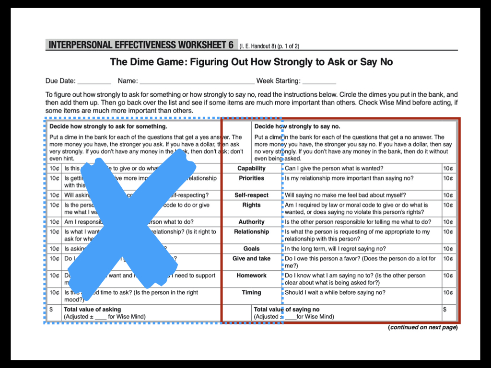

## Evoking a Magic 8 Ball

In my brainstorm, saying yes, no, and maybe conjured memories of Magic 8 Balls and watching the triangle floating to the top with the answer appearing as white text with blue liquid around it.

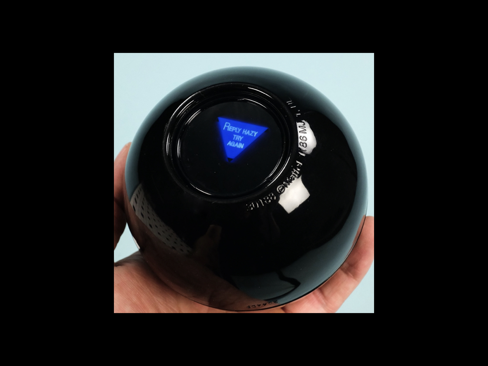

**Abstracting the Magic 8 Ball image** led me to a rounded equilateral triangle shape, the purplish blue color, a font that recalls 80's game shows. Here's a first draft of the **abstract combination logo**.

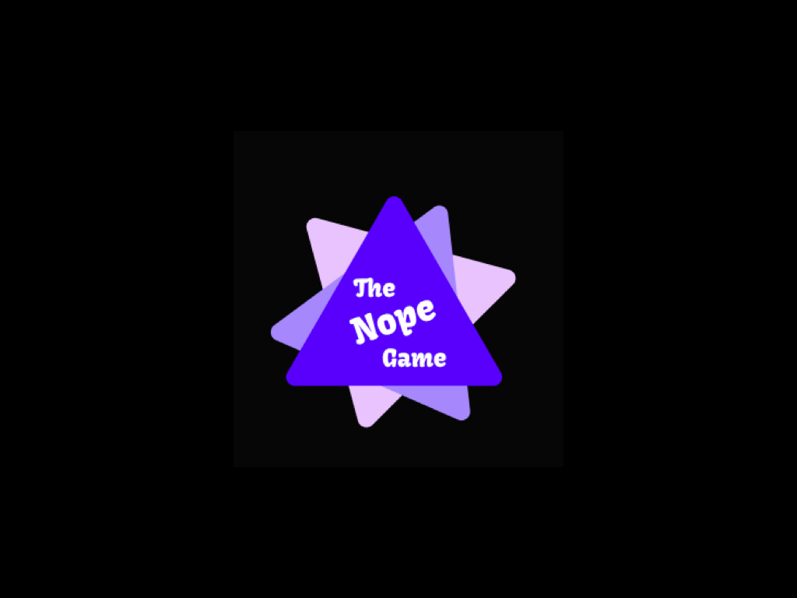

The layered triangles are intended to mimic motion, like shaking the Magic 8 Ball or playing a card game and splaying the cards out in your hands.

This is the first logo I've designed, and it was fun to experiment.

## Changing the genre

At the heart of The Nope Game are a series of yes or no questions. If you look at an example of the worksheet after someone has used it, they scribble “yes” or “no” or checks and x's in the margin because the worksheet doesn't have an official place to write answers.

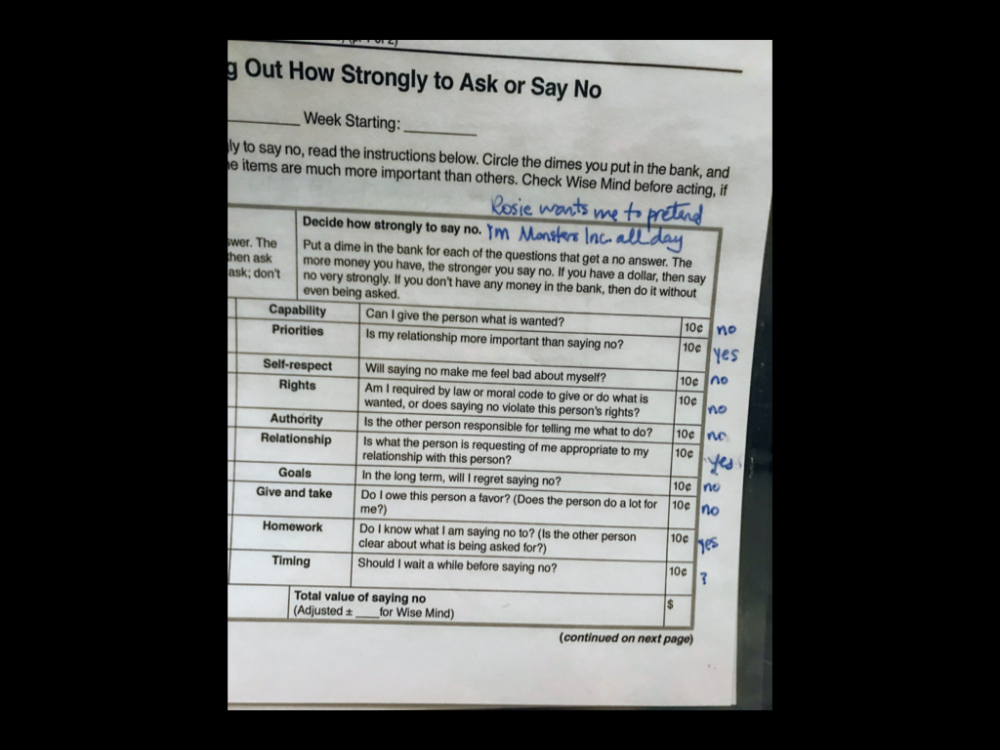

In addition, there's some tricky math involved in adding up the responses. To save the user from doing the math, and **to reduce the amount of work it takes for them to track their answers** to each question, I put the game into a survey format on a website.

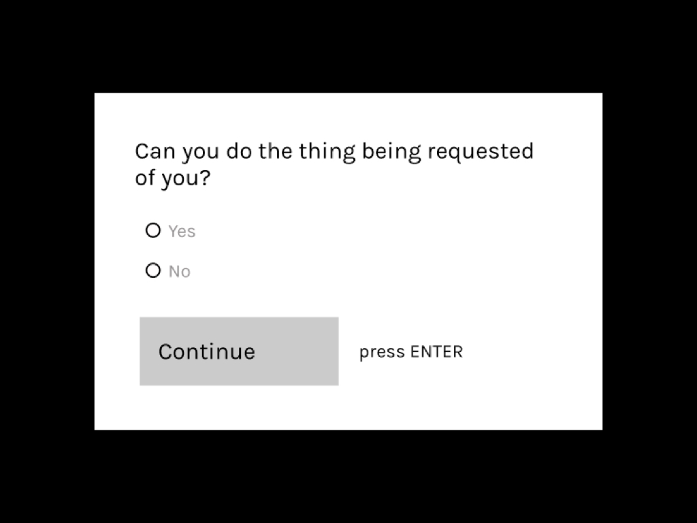

### Emphasizing prerequisites

One of the last questions on the worksheet is a sticking point for many people and blocks them from finishing the game. “Do I know what I am saying no to? (Is the other person clear about what is being asked for?)”

**A text input box had two advantages over a yes or no survey question.**

## Validating the answer

First, if the user is able to write down the other person's request in the text input box, the request must be clear enough. **Writing your answer and seeing it offers powerful validation** that yes, you _do_ know what you're saying no to.

## Creating a visual reminder

Second, a text input box remedied a shortcoming of the online survey. On the worksheet, most people scribbled a reminder of which scenario they were evaluating, e.g. "my neighbor wants to keep their food in my fridge." This allowed them to re-read their scenario if they wanted to revisit their decision or stop the game to go get a snack and return to it later.

The online survey initially lost this visual reminder. A worksheet has permanency and can keep visual reminders better than a survey; this is why many people still write passwords on sticky notes, to the chagrin of security-minded folks everywhere.

The text input box restored that visual reminder. After a user enters text, the text **sticks to the top of the screen so users can refer back to it at any point**.

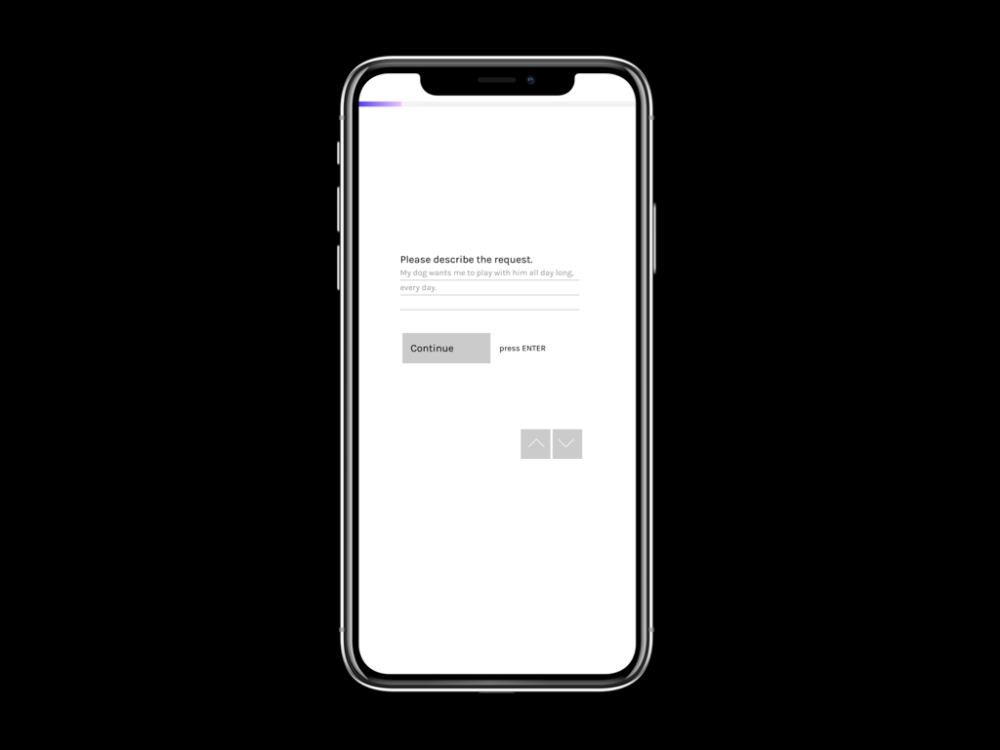

## Dealing with deal breakers

One survey question is a deal breaker. If you answer “no” to “Can I give this person what is wanted?”, there is no need to take the rest of the survey because, without further effort, you tell the person “no, I can't do that.” The survey needed to prioritize this question so users could skip the rest of the survey if they answer no.

## Evolving the game

The pure visual design of the online survey doesn't match my vision yet; I haven't spent any time on font, alignment, color, etc. So that's one next step.

Another structural change will be to let users save notes under each survey question so they can remember their reasoning, and to make the details viewable and editable at a later time if they want to revisit the decision.

Finally, people often want to share the results of their game with others to get their friends to weigh in on their decision. It's helpful to get alternate perspectives to see if they validate or differ from yours.

To that end, I'd like to make results shareable and make it easy for viewers to take your quiz so you can compare answers.

## A special thanks

I'd like to thank Marsha M. Linehan, the author of the worksheet, and Doug Benson, the person who introduced me to it.

> “People have not caused all their own problems; They have to solve them anyway.”

<small>—Marsha M. Linehan, author of _DBT Skills Training_, includes the Dime Game worksheet</small>
