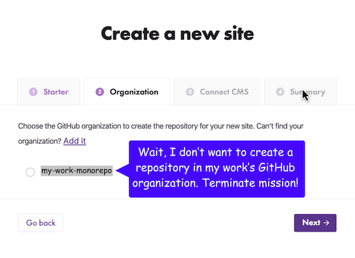

After Gatsby's Cloud product launched, [FullStory](https://www.fullstory.com/) clips made it obvious that some users struggled to onboard. To learn why, I setup usability tests with 5 Gatsby users and 5 developers who hadn't used Gatsby before to watch them onboard.

The usability tests identified a point of confusion that stopped most folks from going forward.

## The default option wasn't always right

The default option at the time was saving the first project in a GitHub organization. Most people belong to their work's GitHub organization, and this is the one they would add. However, they didn't usually want to save their first project in their work's GitHub org.

My first impulse was to resolve this problem by making the "add another organization" button more obvious so they weren't stuck with the default option. However, this didn't solve the problem.

## Making the common path easier

Through pressing my coworkers for more details, I discovered that not only could we offer an alternative to the default option, we could also provide a _better_ default option. I asked my coworkers: "where do users actually want to save their project?"

The answer is that most users wanted to take the product on a test drive before trying it on a work project. We needed to make this path easier. A low stakes area for a test drive is the user's personal GitHub account, so we designed a way for this to become the default location for the project.

## Results

Myself and a developer designed a solution that makes the correct assumption that most users want to make their first site in their personal GitHub account. The design still gives them the option to add their work organization if our default assumption is wrong.

We also added a field for them to name their site because it's fun and gives the project a recognizable name in both Gatsby Cloud and their GitHub account.

We tested our assumptions by doing 5 usability tests and also watching FullStory clips and the new flow worked in every case.

_Original post on the [Gatsby Blog](https://www.gatsbyjs.com/blog/2019-12-11-reducing-interaction-cloud)._
