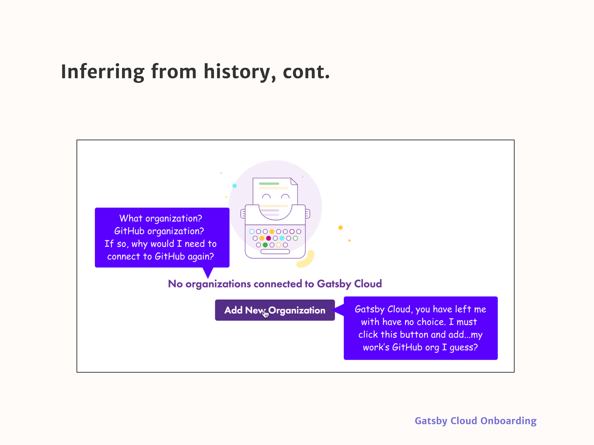
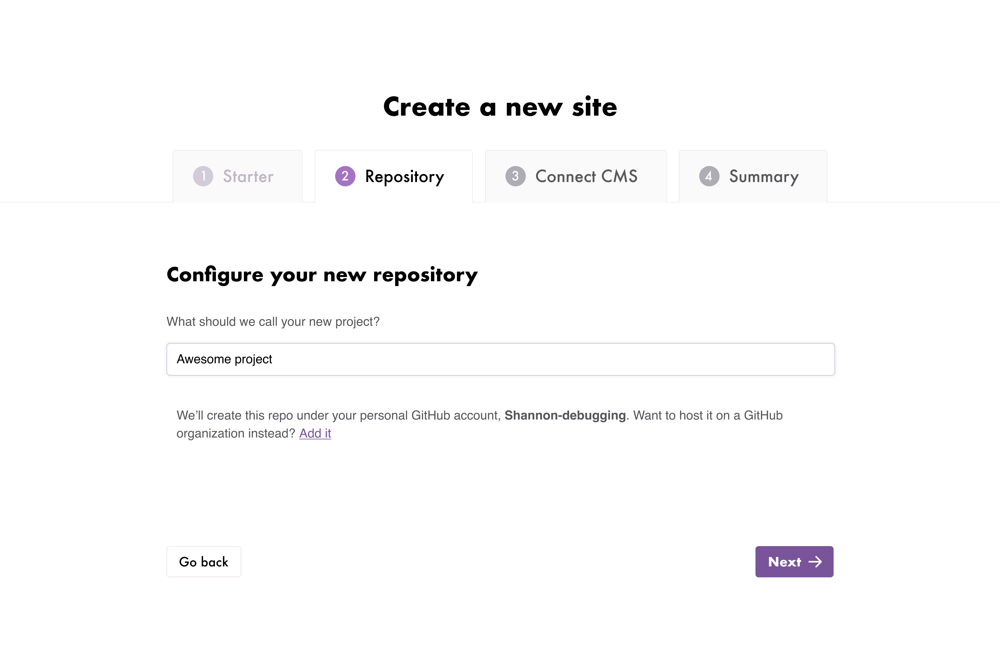
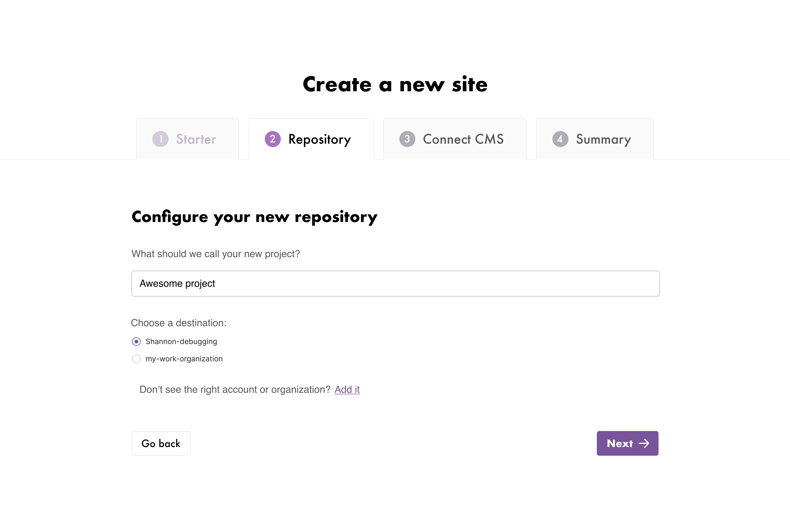

After Gatsby launched our cloud website hosting product (a developer tool), I reviewed [FullStory](https://www.fullstory.com/) clips and it soon became obvious that some users struggled to finish creating a new site. To learn why, I setup and ran 10 usability tests in which I watched five existing Gatsby users and five new users onboard onto Gatsby Cloud.

My usability tests identified the moment where most users dropped off.

## Unnecessary interaction: user must choose where to save their first project
When a user decided to create a Gatsby Cloud site for the first time, the onboarding flow asked them to select a GitHub organization so it would know where to save the site, despite this step not being necessary or, as it turned out, what most new users wanted.

Most users wanted to take Gatsby Cloud for a test drive by making a project in some sort of sandbox.

*The core problem:* The user had to do work (choose a place to save the project) that the system could have done for them by selecting an acceptable default location where the project could be saved.

## User leaves onboarding once they realize their site will be saved in a weird place
Most users added their work’s GitHub organization. After they realized that their Gatsby Cloud site would be saved there, and with no way to back out, they often left onboarding. They didn’t want to save a random new test site amongst work projects.

## Redesign
Working alongside a developer, I redesigned this section of onboarding with the assumption that most users wanted to take the product on a test drive before trying it on a work project. We needed to make this path easier. A low stakes area for a test drive is the user’s personal GitHub account, so I designed a way for their personal GitHub account to become the default location for the project.

The redesigned flow gives them the option to add their work organization if our default assumption is wrong.

How did I make these decisions?

## (Unnecessary) interaction is negative
Anything software can do to reduce the amount of unnecessary interaction it takes to reach a goal is good.

### Reduce interaction by inferring from history and the environment
To reduce interaction, infer “as much as possible from history and the environment.”

> If the software properly infers as much as possible from history and the environment, it should be able to produce at least a reasonable starting point for the context model. Most of the user’s interaction will then consist of correcting (or confirming) the software’s predictions. This is generally less stressful [for the user] than constructing the entire context from scratch.
— Brett Victor, “Magic Ink”

The ideal situation: a product makes a mostly accurate guess about what the user wants and the user corrects the guess if it’s wrong. And the product’s guess will be right most of the time, if it infers from history and the environment.

So what could we infer from “history” and the “environment” to solve the problem we had in Gatsby Cloud? We could make a default selection that was more likely to be right.

### First-time visitor
The wireframe below shows my redesign, in which the user does not have to interact with the software to tell us where to save their site, though they can correct the default (their personal GitHub account) if it’s wrong.

I visually de-emphasized the “where do you want to save this project?” choice so users could focus on the fun part: naming their project.

### Returning user
If there is a returning user that has already connected their personal account plus at least one more organization, their personal account will be the first item in a list and will always be pre-selected, with any work organizations as the second, third, etc. choices. This makes sure that, again, they do not have to interact with the software except to correct it, if it’s wrong.

See wireframe on the next page.

# Results
We tested our assumptions by doing five additional usability tests and watching FullStory clips and the new flow worked in every case.

_Original post on the [Gatsby Blog](https://www.gatsbyjs.com/blog/2019-12-11-reducing-interaction-cloud)._
