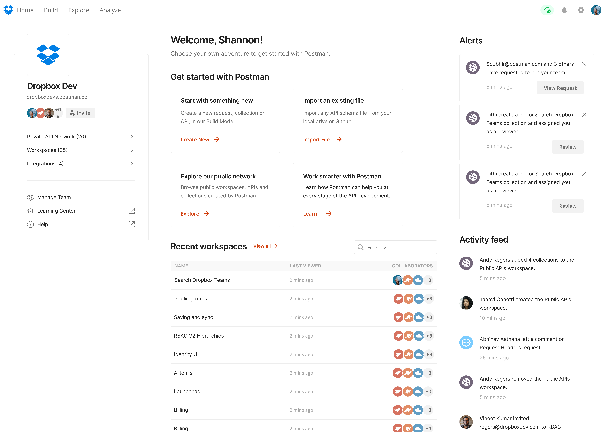

## What I did
At Postman, we knew that users who performed these two actions were more likely to still be using Postman six months later:
1. send a request
2. save that request in a collection

We called these users "activated users".

- Activated users have a 41% chance that they will still be using Postman 6 months later.
- Users who are not yet activated are 28% likely.

I was assigned to pursue the open question "how might we help more Postman users become activated?" This would help them experience the value of the product and improve our business.

## Helping users who want to take the product for a test drive
Through recruiting for and running five usability tests with developers using Postman for the first time, I learned the following:
1. Some new Postman users are testing out the platform to see if it meets their needs.
2. Some new Postman users are already convinced of its value. They create an account and intend to use Postman as long as nothing blocks them. 

I decided to focus on helping that first group test out the platform as quickly as possible, because I hypothesized they were the most likely to give up if they ran into friction early in their experience. 

## My hypothesis
The five usability tests I ran led my to this hypothesis: 
- Low-intent users want to send a request to test out Postman, yet they don’t see an obvious option to send a request during Postman onboarding. If we increase the visibility of sending a request, more users will try it and become activated.

Here are users reactions when they first landed on the Postman app's homepage:

> "Why is the invite button the most important thing on the homepage? I don’t think that’s very important right now. I’m trying to test it out."

<small>—Ebru, Backend Developer</small>

> "Ok, how can I send an API request?"

<small>—Gaurang, Backend Software Engineer</small>

## Interviewing my design predecessors

Because I had only been at the company for 2 months, I decided to interview designers who previously worked on the homepage to ask them why they made certain design decisions. I didn't want to try something they'd already tried before, and I wanted to respect any decisions that were made for really good reasons. 

What I found is that most designers were already frustrated with the cluttered homepage and just never had the time to prioritize cleaning it up. It was also a politically messy area for designers since every part of the Postman app wants to be represented on the homepage, so it takes assertive/proactive effort to keep it from becoming bloated.

## Choosing an easily removeable design

After these interviews, I concluded that an easily removable design would be the best option for two reasons:
1. It would be fast to implement
2. It would be easy to remove if it failed
3. Because of the previous two reasons, it would cause the least internal resistance and ship quickly

I do think bigger redesigns can be impactful. There are pros and cons to small vs. dramatic changes.

## Reducing user's cognitive load
After a low-intent user clicks on "send a request", I decided to provide a default request that produced a mini-tutorial in the response. This could help users test out Postman without any unecessary work on their part, and with the bonus that reading the response could give them tips on what to try next.

## Results
This experiment was a partial success. We saw the following:
- a 4% increase in # of users sending their first request
- the new design was a significant improvement upon the control

What I learned is that increasing the number of users sending a first request did not increase user activation metric, because users who send a first request aren’t necessarily more likely to create a collection. Maybe they don't even know they can save the request in a collection. 

## Followup experiment
A colleague created this followup experiment.

Hypothesis:
- Nudging users to create a collection if they have sent X numbers of requests (without creating any collection) will help increase the number of activated users.

## Results
This followup experiment added to the partial success of the first one. It strongly correlated with an increase in the number of users creating collections & becoming activated. 

From this result, we learned that many users want to create collections once they know about them.

## Final step
Normally, experiments are only shown to a small percentage of users for a short time period, e.g. 1-2 weeks. If they are successful, we show the feature to all users.

Because these two experiments were successful, they were turned on so **100% of users see them**. It continues to be exciting to see these simple steps make an impact!

