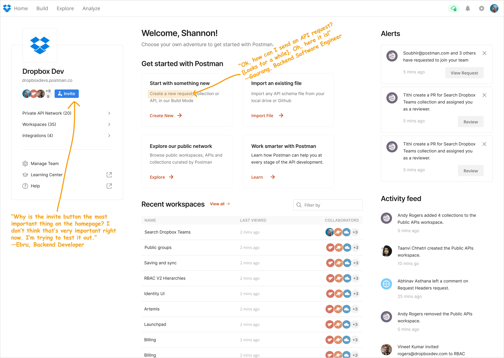
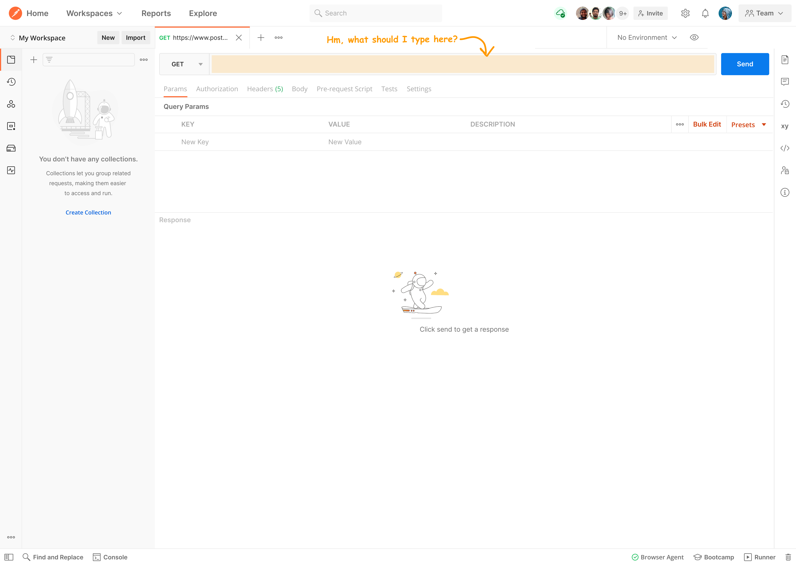
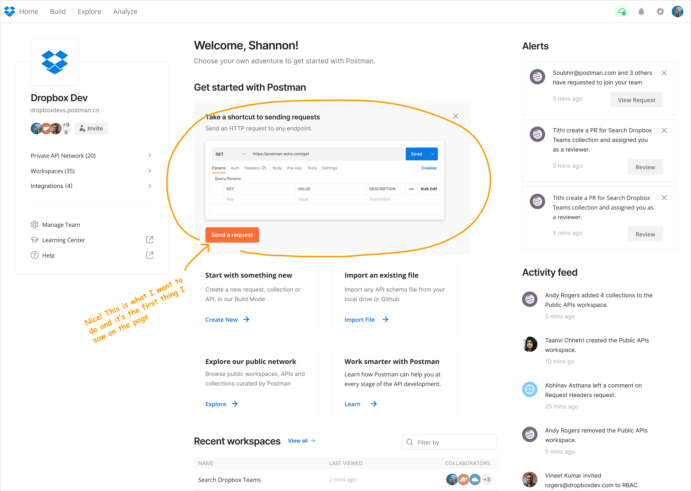
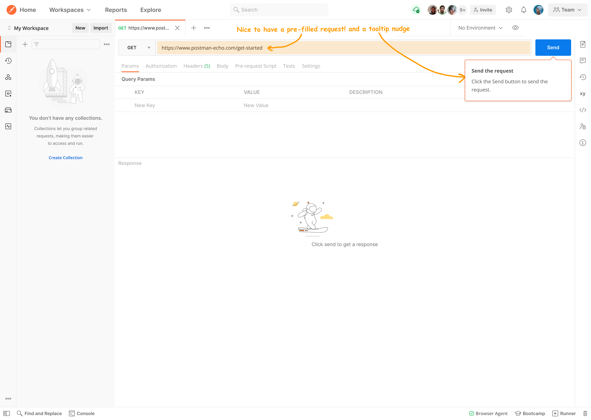
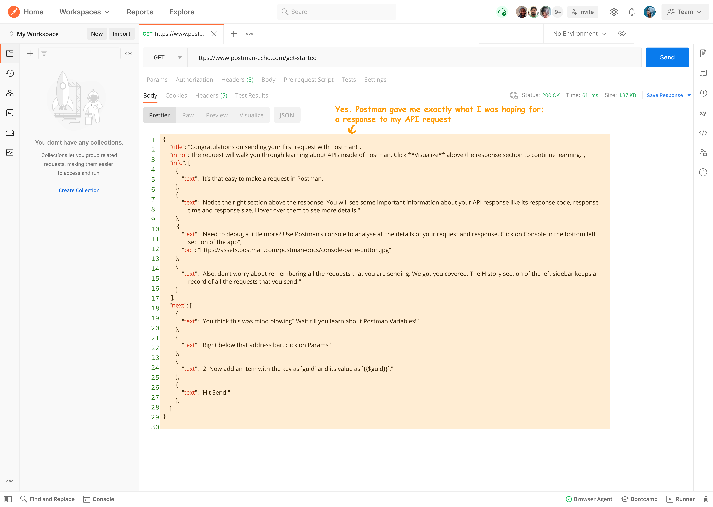
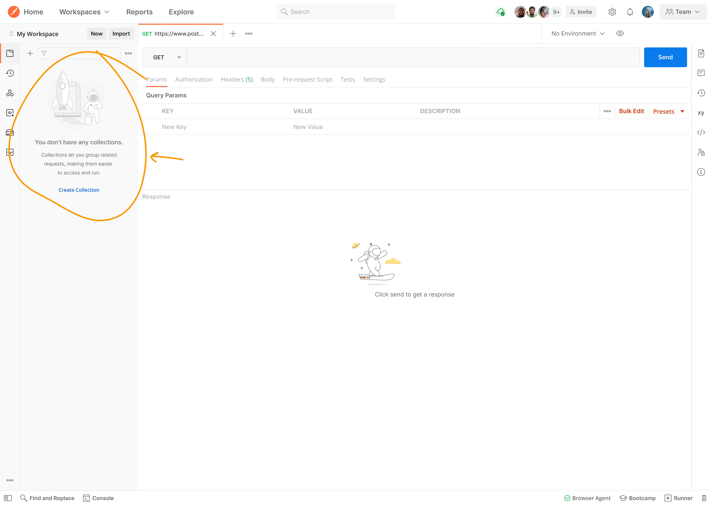
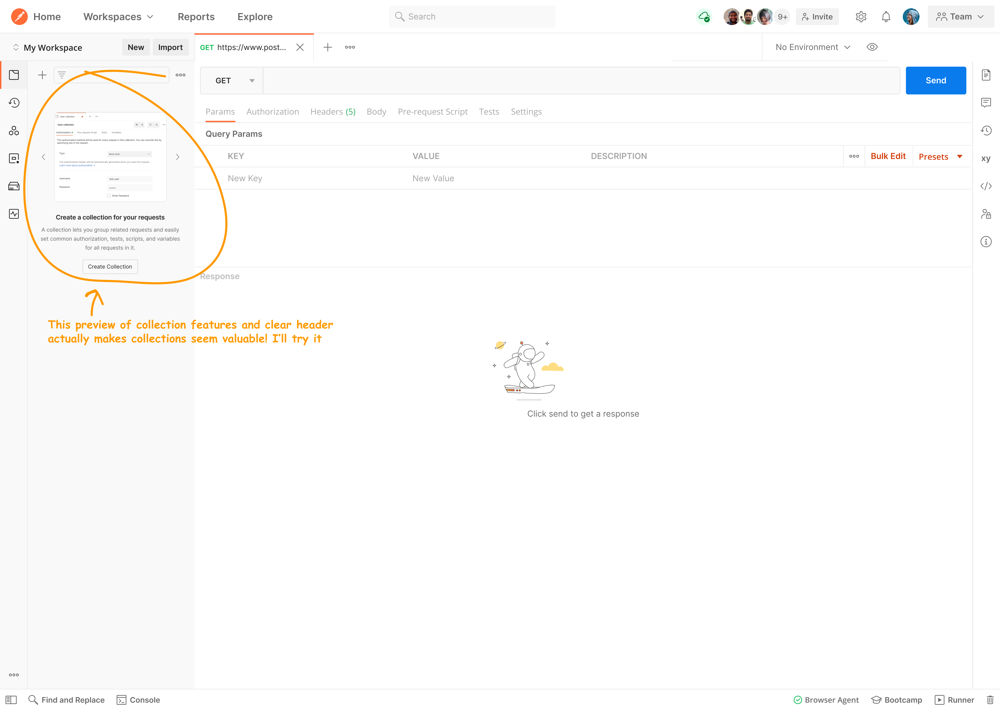

## What I did
I pursued the open question "how might we help more Postman users become activated?" My design led to a 4% increase in users performing the first step of activation.

## How did we define activation?
Activated users performed these two actions during their first few days using Postman, and were more likely (41% vs 28%) to be using Postman 6 months later:
1. send a request
2. save that request in a collection

## Helping users who want to take the product for a test drive
Through recruiting for and running five usability tests with developers using Postman for the first time, I learned the following:
1. Some new Postman users are testing out the platform to see if it meets their needs.
2. Some new Postman users are already convinced of its value. They create an account and intend to use Postman as long as nothing blocks them. 

I decided help the first group test out the platform as quickly as possible. We could make more impact by helping them since they were the most likely to give up if they ran into friction early in their experience. 

## Why did low-intent users not activate? My hypothesis
The five usability tests I ran led my to this hypothesis: 
- Low-intent users don’t see an obvious option to send a request during onboarding, even though that's what they want to do. If we increase the visibility of sending a request, more users will try it and become activated.

### Old step 1: homepage

### Old step 2: send request
Once users clicked on "Create New" and elected to send a new request, they saw this:

## Interviewing my design predecessors

Because I had only been at the company for 2 months, I decided to interview designers who previously worked on the homepage to ask them why they made certain design decisions. I didn't want to try something they'd already tried before, and I wanted to respect any decisions that were made for really good reasons. 

What I found is that most designers were already frustrated with the cluttered homepage and just never had the time to prioritize cleaning it up. It was also a politically messy area for designers since every part of the Postman app wants to be represented on the homepage, so it takes assertive/proactive effort to keep it from becoming bloated.

## Choosing an easily removeable design

After these interviews, I concluded that an easily removable design would be the best option for three reasons:
1. It would be fast to implement
2. It would be easy to remove if it failed
3. Because of the previous two reasons, it would cause the least internal resistance and ship quickly

### New step 1: see send request option on homepage

### New step 2: send request

### New step 3: see response

## Results
This experiment was a partial success. We saw the following:
- a 4% increase in # of users sending their first request
- the new design was a significant improvement upon the control

Why did it work?—reducing the user’s cognitive load
After a low-intent user clicks on "send a request" on the homepage, the default request that produced a mini-tutorial in a response helped users test out Postman without any unecessary work on their part, and with the bonus that reading the response could give them tips on what to try next.

## Followup experiment
Increasing the number of users sending a first request did not increase the number of collections created (second step in user activation metric). My hypothesis was that they don't know why they should save the request in a collection. 

A colleague and I collaborated to create a followup experiment, based on the hypothesis that strongly and clearly nudging users to create a collection if they have sent X numbers of requests would help increase the number of activated users.

### Old design

### New design

## Results
This followup experiment added to the partial success of the first one. It strongly correlated with an increase in the number of users creating collections & becoming activated. 

From this result, we learned that many users want to create collections once they understand what they are.

### View old user flow in Figma!
<iframe style="border: 1px solid rgba(0, 0, 0, 0.1);" width="100%" height="450" src="https://www.figma.com/embed?embed_host=share&url=https%3A%2F%2Fwww.figma.com%2Fproto%2Fkztr50mArdY9Gow8eh58bs%2FPortfolio-Website-Image-Files%3Fpage-id%3D23%253A776%26type%3Ddesign%26node-id%3D232-4503%26viewport%3D221%252C538%252C0.06%26t%3D1VzHzIQU3W53caNr-1%26scaling%3Dcontain%26starting-point-node-id%3D232%253A4503" allowfullscreen></iframe>

### View new user flow in Figma!
<iframe style="border: 1px solid rgba(0, 0, 0, 0.1);" width="800" height="450" src="https://www.figma.com/embed?embed_host=share&url=https%3A%2F%2Fwww.figma.com%2Fproto%2Fkztr50mArdY9Gow8eh58bs%2FPortfolio-Website-Image-Files%3Fpage-id%3D23%253A776%26type%3Ddesign%26node-id%3D29-1965%26viewport%3D221%252C538%252C0.06%26t%3D1VzHzIQU3W53caNr-1%26scaling%3Dcontain%26starting-point-node-id%3D29%253A1965%26mode%3Ddesign" allowfullscreen></iframe>

## Final step
Normally, experiments are only shown to a small percentage of users for a short time period, e.g. 1-2 weeks. If they are successful, we show the feature to all users.

Because these two experiments were successful, they were turned on so **100% of users see them**. It continues to be exciting to see these simple steps make an impact!

