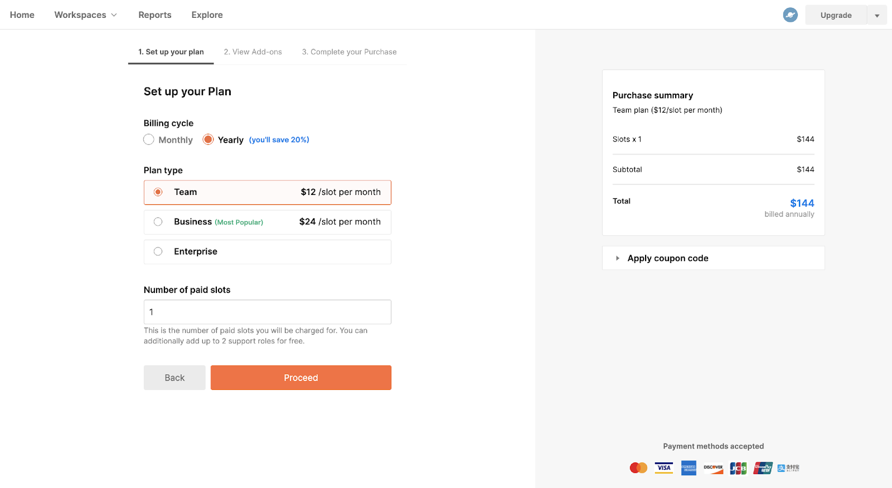
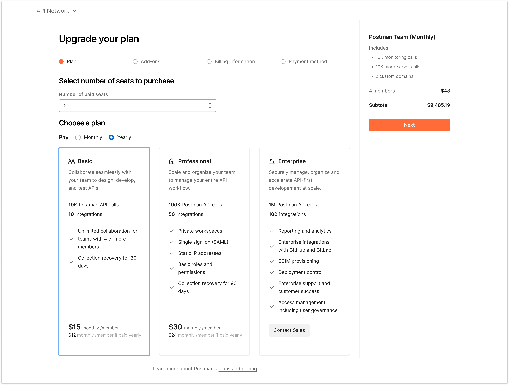
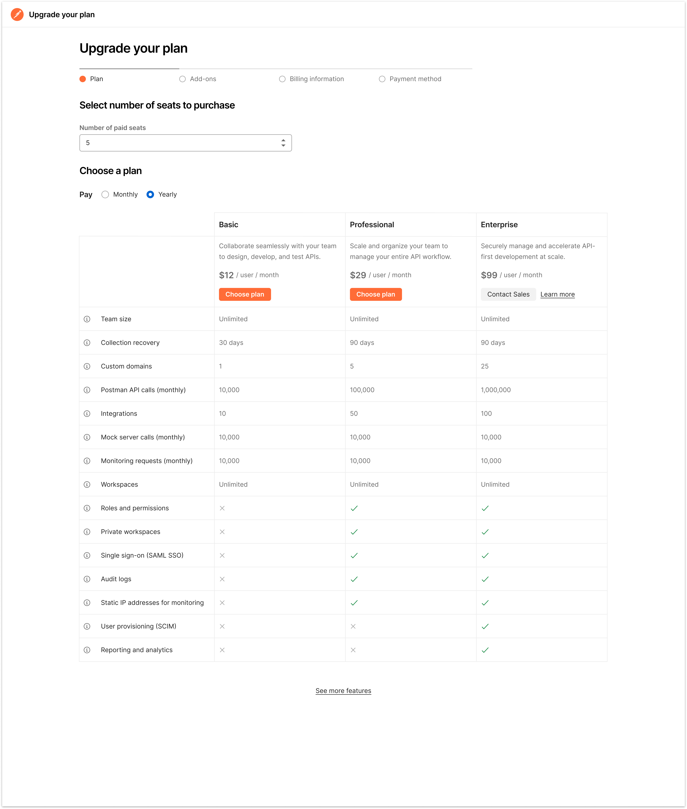
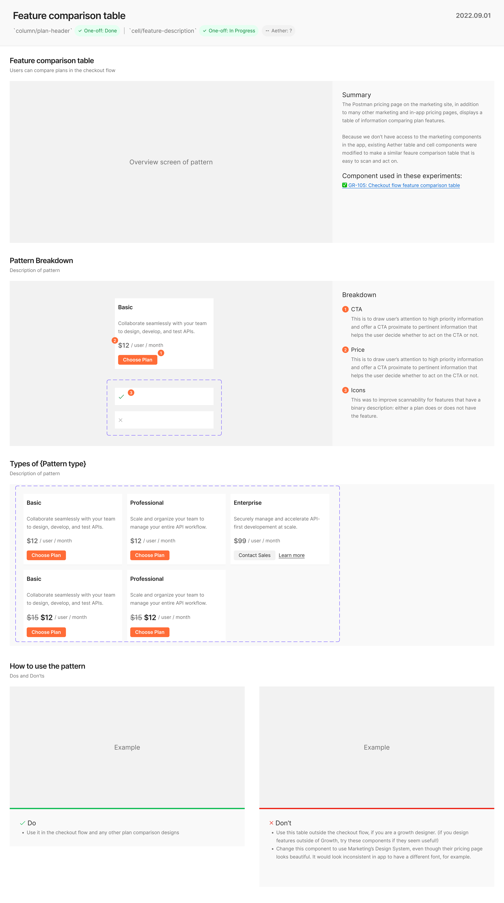

I redesigned Postman's checkout flow by replacing a card design with a feature comparison table.

## Why?
The previous design didn't meet our user's core need, which was to fully evaluate each paid plan's features and compare plans to each other (full explanation in following sections).

For context, here are all three versions.

### 1. Radio button list
A different squad designed this radio button list of the three plan names with their prices. It left users with a couple questions:
- What features do these plans include?
- What are my usage limits in each plan?

### 2. Cards with plan summaries
Based on those user questions, the same squad created a new design. cards with the plan name, description, some feature names, and the price. Their hypothesis was that users wanted a visually appealing summary of the plans so they could see the most important features and quickly make a decision without needing to think too much.

I worked closely with the other squad's designer to learn if this card design answered user's questions fully. I read customer support tickets and community forum posts. I found there were some outstanding questions:

- What are *all* my usage limits?
- What roles are available and what permissions do those roles have?
- What does each feature actually do?

### 3. Feature comparison table
> “Edward Tufte’s first rule of statistical graphic design is, “Show the data.” All information graphics, statistical or not, must present the viewer with enough information to answer her questions. It seems that many software designers, in their focus on functionality, forget to actually present the data.” — Brett Victor, “Magic Ink”

Based on the previous UX research and my knowledge of core design principles, like Bret Victor's mantra, "show the data", I developed a new hypothesis: 

*When looking for a SaaS product that meets their needs, users want to compare plans to see which best meets their needs. In order to compare plans, they need a complete description of what features are included in each one.*

With this hypothesis in mind, I articulated to my team that tables are likely the best choice to test our hypothesis because they have the following advantages:
- a table could fit nearly every feature above the fold
- columns and rows make it easy to compare data
- users are familiar with tables since many SaaS products use them to present paid plans
- tables have been around forever, and for good reason; they work well. we don't need to reinvent the wheel

I designed this table and created tooltips so users could read a more complete definition of each feature. I presented this idea to my squad and people were excited, so they shipped it.

## Results

### What did I learn?
I learned that users who hovered over at least one tooltip were:
- 6x more likely to move to page 2 of the checkout flow
- 4x more likely to convert to paid

This means that our hypothesis was true. 

Hypothesis: When looking for a SaaS product that meets their needs, users want a complete description of what features are included on each pricing tier so they can make an informed decision.

Why would this hypothesis be true? When high-intent users evaluate a technical tool's paid plans, they want as much information as possible about the paid features. It's an expensive purchase and determines how they'll spend a lot of their time, so they aren't going to click "complete purchase" until they are super confident they're getting the features they need.

### Business goals
Our primary success metric was page 1 to page 2 of checkout flow,  showed stat-sig improvement of 1.48% as compared to control. This brings us to a P1 -> P2 conversion rate of 5.51% for variation, and 4.03% for control. 
- increase in overall paid conversion by ~ 0.2% (or ~12% improvement over baseline). This is not stat sig yet but we have 88% chance of this improvement being due to the experiment design.

During the two weeks this experiment ran, 224 of the teams who saw the experiment upgraded, which is 17 more teams than the control. We are ~80% confident that the higher number of upgrades was due to the new design (the limiting factor was sample size).

Over a 12 month time period, the new design would theoretically make the company $330k ARR.

## Figma components
I created new Figma compononents to iterate faster on this design. After the experiment succeeded, I documented the new components and am proposing adding them to the Design System to enable faster future iteration.

