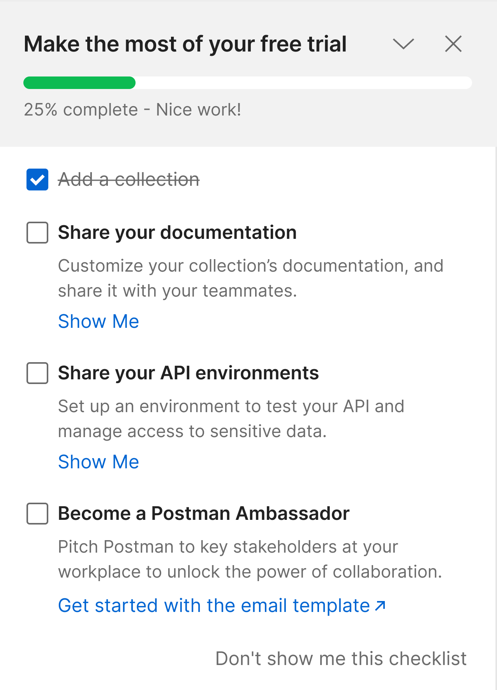
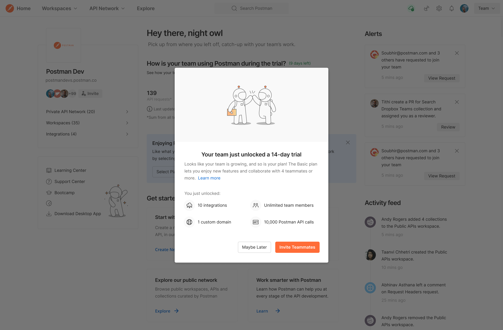
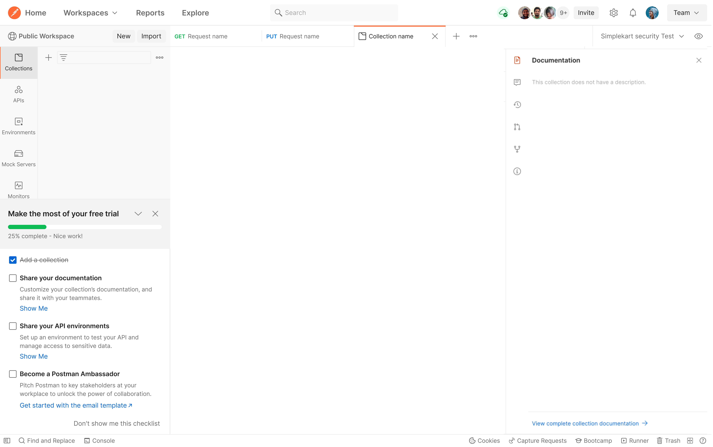
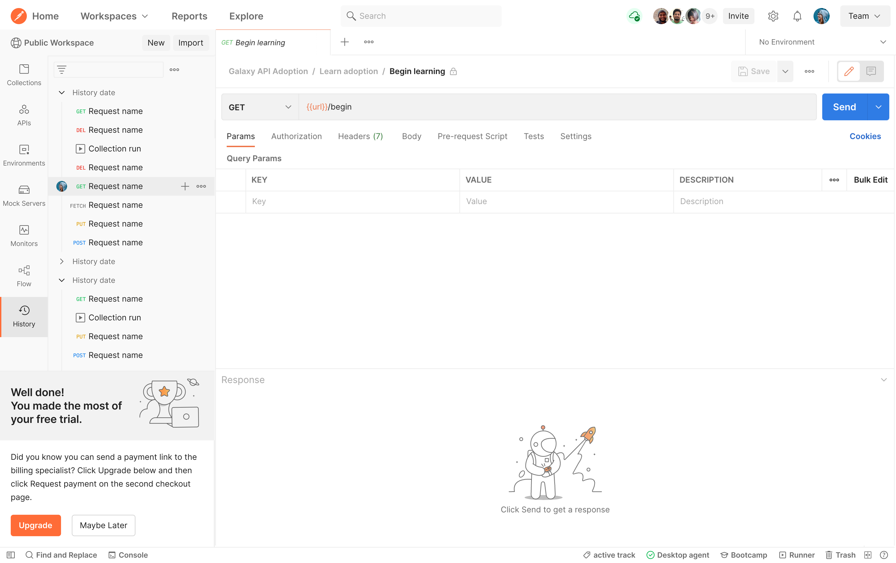

I designed and shipped a user experience to help Postman users get the most out of their 14-day free trial.

## Why I did it

The previous free trial experiment increased conversion rates from 1.31 to 1.72%. I thought we could do even better than that, especially since users had essentially zero assistance knowing what their trial included or how to take advantage of it. They just saw this modal, and that was it.

## First of all, why did the previous trial experiment succeed?

I needed an answer to this question, so I interviewed 7 users who upgraded during/after the trial to ask: "Why did you upgrade after the trial?"

> Onboarding new people quicker. Environments help when I just need to make sure that I don't share some protect production credentials.
> —Tobias, Startup founder

> Sharing Postman documentation in sales calls moved the sales process along faster because it turned 1 hour long calls into 15 minute calls when we met with the other company’s engineers and said “here’s our Postman documentation.” The other company’s engineers would say “oh, we know how to use that, sounds good.”—Ben, VP of Eng at a startup

> I wanted to add team members and pay for the seats to share documentation, collections, and more without needing to update it in more than one place. Contractors are less confused in Postman about what props are optional vs required, and they seem more familiar with the request and response format than other tools he tried outside Postman. —Oliver, Developer

## So, why _was_ the previous trial experiment successful?

Quick summary of the UX Research results:

- They need more than 3 people on their Postman team
- They need to share collections, environments, and documentation with more than 3 ppl

## Hypothesis

Based on the UX Research results, I asked our data analyst to see if there was a correlation between conversion and teams that edited documentation and/or edited environments. There was a strong correlation. With that qualitative and quantitative data in mind, I created this hypothesis:

_Increasing the visibility and usability of documentation and environments to trial teams will lead to more conversions, because the team will start inviting more team members who need those resources._

## New user flow

Three steps.

### First, user sees existing modal

### Second, user sees a checklist in their workspace

### Third, user gets a hint on how to make paying easier

## How did this project improve existing design system components?

### Adding “Don't show me this checklist"

The previous checklist did not allow users to dismiss the checklist. The ‘x’ icon just collapsed the checklist into further collapsed state—a rocket illustration on the sidebar. I hypothesized that users would expect the 'x' to completely dismiss the checklist forever. In order to test this hypothesis, I kept both the ‘x’ and ‘don't show me the checklist' button so I could track how users interacted with them. If users clicked on the “x” > click on the rocket icon to reopen it > click on “dismiss checklist”, I'd know that users expected the “x” to close the checklist forever and we can adjust the design to meet their expectations.

### Manual checkmarks vs automatic checkmarks

We did consider automatically checking off each item on the list, triggered by user behaviors. I decided to use manual checkboxes instead, for two reasons:

- it was faster to test our hypothesis with manual checkmarks instead of the arduous task of deciding what exact user behavior would trigger a automatic check mark to appear since the tasks are quite complex
- in usability testing with coworkers, most developers appreciated the manual checkmarks; they liked feel empowered to decide when they felt done with a task instead of the system deciding for them

## Results

The trial checklist experiment was inconclusive, yet we still learned from it.

### Numbers

It was not able to drive a significant positive increase in paid conversion for trial teams. There was also no impact on the % of teams who sent mid-trial invites, meaning that the suggested actions didn't push users to expand their teams while on trial.

Only a small minority of treatment users engaged with the checklist items - just 6.8% completed an objective (in this case by manually clicking on the checkbox), and 42% closed the checklist in under 5 minutes from seeing it for the first time.

### What did I learn?

Despite the inconclusive results, I still learned something valuable. Teams in which someone DID complete an item converted at directionally elevated rates, showing a connection between the performing the specific actions chosen in the design and higher-intent teams.

This learning validated my UX Research findings and meant this statement is almost surely true: sharing documentation and sharing environments are crucial features for teams growing past 3 members. So crucial, they are worth paying for.

## Next steps

We learned why some teams DO convert. It's time to investigate the big unanswered question: Why do many teams NOT convert?
