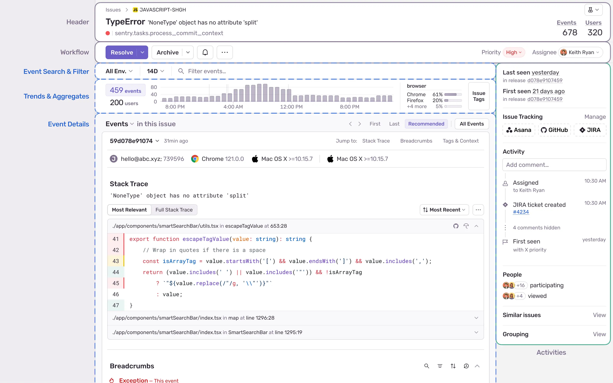
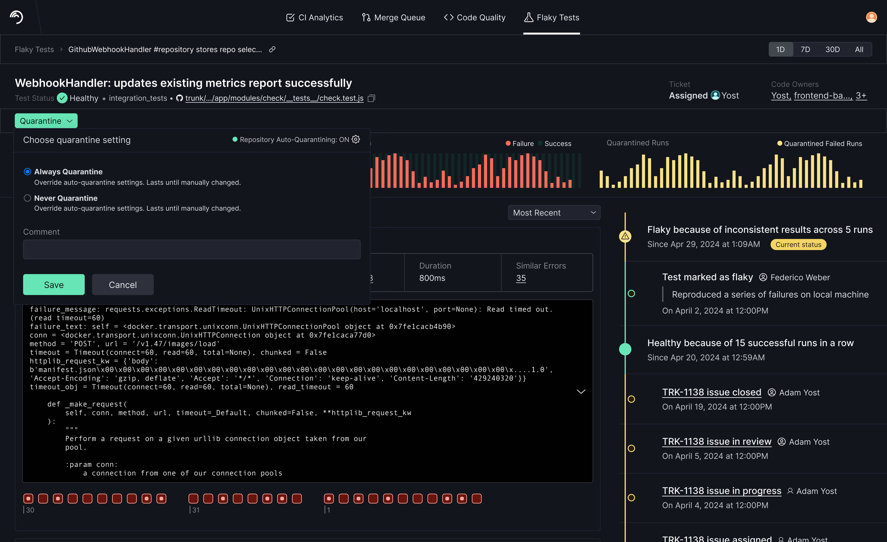
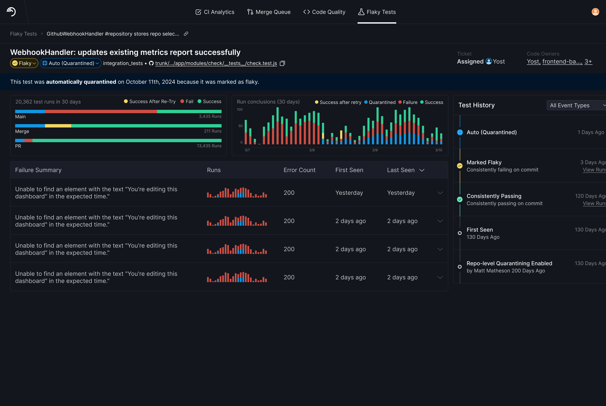
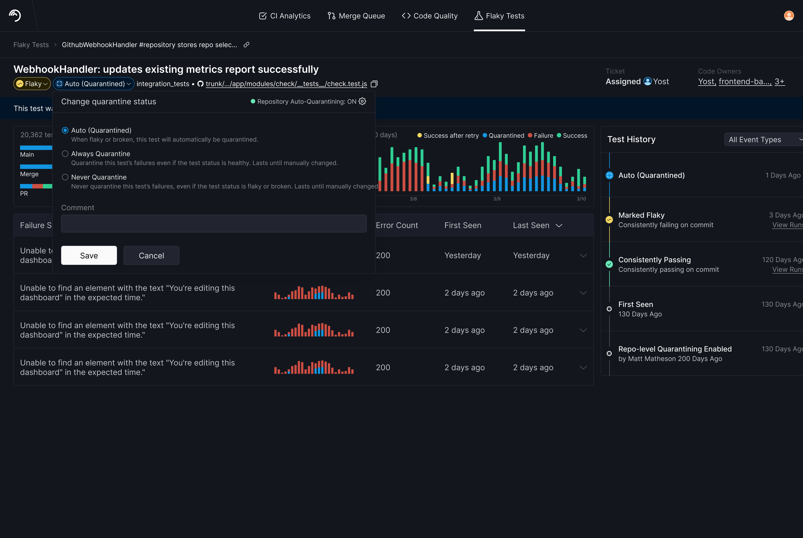

 
**Role:** Senior Product Designer (generative research, IA, interaction design, usability testing)
**Team:** PM, Engineer, Product Designer (me)
**Timeline:** [8 weeks; shipped Q2 2025]
**Platform:** Trunk Flaky Tests — a CI tool that detects and quarantines unreliable tests
 
## TL;DR
 
At Trunk, we introduced a paid feature called Quarantining, and usage numbers weren't as high as we predicted. To investigate the reason, I conducted user interviews, competitive analysis, and three rounds of usability testing and discovered usability issues.
 
I redesigned the quarantine feature with increased visibility, a simplified mental model, and a way for users to save and view why the status changed. My designs shipped to production and passed customer usability tests, ensuring that usability issues were no longer a barrier to feature usage.
 
## What are Flaky Tests and Quarantining?
 
Flaky tests are tests that fail randomly. They waste engineering time as engineers try for hours to get their PR to pass the test, only to realize eventually they cannot reliably make it pass. To save engineers from this pain and drain on their time, Trunk's Quarantining feature allows engineers to quarantine flaky tests, so that the tests keep running but don't block engineers from merging PRs. The user chooses between two quarantine modes: automatic, when the Trunk Flaky Test product automatically detects and quarantines flaky tests, and manual, when a CI owner sets the quarantine status.
 
## Business Problem
 
Trunk's Flaky Test product's business model included Quarantining as a paid feature, so low feature usage meant companies weren't upgrading to get access to Quarantining. We wanted to find out if the feature lacked usability or value (or both!).
 
## Original Design's Problems
 
Customer access at Trunk was tightly gated, so I first ran internal usability testing before spending our limited customer access. Sessions with participants of mixed familiarity, plus async feedback threads, surfaced clear insights. The Quarantining feature suffered from low visibility, a lack of a unique visual identity, mismatch with the user's mental model, and requiring a leap of trust before proof.

### Low visibility
 
- **A buried bridge.** The link from CI logs to the Test Detail Page was so low-visibility that users missed it and either never navigated to Trunk's UI or navigated manually.
- **Hidden audit trail.** When engineers saw the test's quarantine status in either GitHub or Trunk's UI, the status left them with many unanswered questions, including: "who changed this status and why? Is this supposed to be quarantined?" Each test's status history (e.g. who changed the status last?) lived in a Status History tab. Zero participants ever found it unprompted.
### Lack of a unique visual identity
 
- **Two statuses, one identity.** Every test has a health status (healthy/flaky/broken) and a quarantine status — but only health had an icon and color, so users often missed the quarantine status when scanning the page.
- **Color collision.** The same yellow meant "flaky" and "quarantined."
### Mismatch with user's mental model
 
The status "Default (Not Quarantined)" was universally confusing. Nearly everyone asked: "Shouldn't there just be two settings — Quarantined or Not Quarantined?" Unanimous confusion isn't an education problem; it's a model problem. The name matched our system, not our users' mental models.
 
### Requiring trust before proof
 
Turning on Auto-Quarantining demanded a leap of trust users weren't ready to make. This was an area where, as a designer, I wasn't yet sure if this was a usability or value problem and wanted to solve the previous three problems to see if it solved this fourth problem naturally.
 
## Defining Success
 
To test usability of my design iterations, I defined success as task completion where testers completed a task list covering every system state. As they attempted each task, I asked them to:
 
- Explain why auto-quarantining changed a test's status
- Set, override, and revert test statuses and save reasons
- Predict the next test run's quarantining behavior — e.g. "if this flaky test runs again, now that you changed it to auto-quarantine, what do you think will happen to it?"
I also proposed post-launch usage tracking.
 
## Benchmarks
 
I led the team in annotating examples of status design from Linear, GitHub, Sentry, Snyk, 1Password, and Figma. The best implementations shared two traits:
 
- The who/when/why stays visible right next to the status (Snyk shows user, reason, and expiration inline)
- Changeable statuses look interactive (Linear's status is the entry point for changing it)
The annotations captured failure modes too — Sentry's buried activity feed and Snyk's silently vanishing rows.
 

 
## Iterations
 
We tested these iterations internally and with customers.
 
### Iteration 1: Card View
 

 
**What worked well:**
 
- **Increasing visibility.** Making Test Status and Quarantine Status equal in visual importance meant users noticed Quarantine Status more often than before.
**What didn't work well enough:**
 
- The actual status names, e.g. "Auto (Quarantined)," still didn't match users' mental models.
- Including a timestamp improved trust somewhat since it answered "who changed this status and when?" However, it felt redundant to hover over it for more details that also existed in the Status History tab.
### Iteration 2: Action Row and Drop-down Modal
 

 
**What worked well:**
- I simplified statuses by replacing "Default (Not Quarantined)" with "Not Quarantined"
- The modal gave enough room to explain the statuses. The status definitions increased user confidence that they understood the consequences of changing the status.
- Having room to save a comment felt natural to users; anyone manually changing the status has a reason they'd like to save for their own record-keeping and for teammates to read later.
**What didn't work well enough:**
- A separate row for the Quarantine button, while increasing its importance, also made it look visually unrelated to test status, even though it is closely related (e.g. if a test is flaky, users might want to quarantine it).
- Preselecting a radio button, while a standard practice, made some users think the selected status was already saved.
### Final Iteration: Compressed Drop-Down 

 
**What worked well:**
- Improved visibility and clarity about what Quarantine statuses mean, how they're related to Test Status, and when and why they change increased users' trust in the feature.
- Test Status and Quarantine Status have unique yet equally important visual identities, so users will notice both and not ignore or confuse them.
- Test Status and Quarantine Status are next to each other, so users can easily use Test Status to decide Quarantine Status.
- The drop-down modal still gives enough space for users to understand each status and leave a comment.
- Bringing the Status History onto the page rather than behind a tab makes it more visible.
**What didn't work well enough:**
- No downsides were uncovered.
## Stakeholder Pressure Resisted

Stakeholders asked to re-add the "Default" statuses. I wrote up the options with explicit trade-offs — under Pros: *"can't think of any."* We'd removed it because hardly anyone, including employees, could articulate what it meant; re-adding it required a banner explaining an unremarkable state. The interview data was already on record, so I could decline with evidence instead of opinion. The default status stayed dead.
 
## Outcome
 
Our final customer validation came back clean: no task failures, no comprehension issues. Every contested element from earlier rounds — the hidden status history, the confusing status names, the preselection trap — was resolved.
 
The designs shipped to production. I left in a company restructuring after launch but before usage data came in. What the design work established: usability issues were no longer a barrier to usage.
 
 

 
## What I'd Prioritize Next
 
- **Granular overrides and expirations** — the "Override" misread exposed real demand for PR- or branch-scoped quarantines with end dates.
- **Suggestions rather than Auto-Quarantining** — close the trust gap by suggesting instead of acting: "this test is failing intermittently — quarantine it and create a ticket?"
- **Discoverability** — increase visibility of the link from CI logs and GitHub bot comments to this part of the UI.
